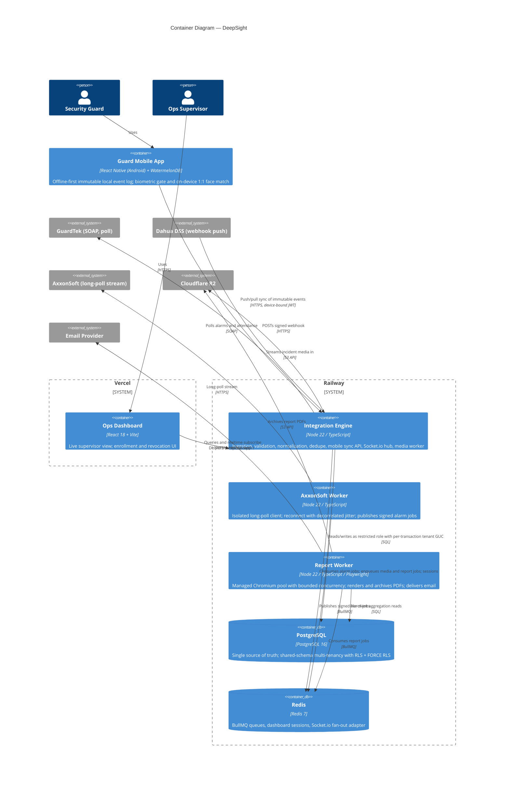
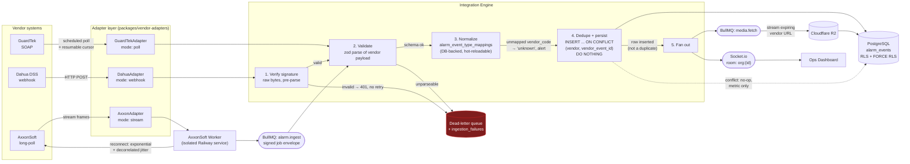

# DeepSight — Guard Operations Platform · System Architecture

**Status:** Draft for review · **Phase:** Pre-build (no implementation code written)
**Author:** Principal Systems Architect
**Date:** 2026-07-30

---

## 0. Build context — greenfield, and what that changes

DeepSight is a **new, standalone platform**. There is no predecessor codebase to extend, mirror, or
integrate with. That matters, because the source brief was written as though several things already
existed:

| Brief asserted | Actual status | Consequence |
|---|---|---|
| "BullMQ — already in use; maintain this pattern" | No existing usage | Kept, but now justified on its own merits (§5) rather than inherited |
| "Cloudflare R2 — already provisioned" | Not provisioned | Becomes a Phase 5 setup task, not an assumption (Open Item 10) |
| "The existing codebase uses Centrifugo for realtime" | No Centrifugo instance | **Resolves the realtime decision**: no shared instance exists to reuse, so Socket.io is chosen outright, not contingently (§5) |
| "`withClientId()` — same pattern as `withOrg()` in the main platform" | No prior pattern | Designed from first principles and justified in §7.2 |
| "Lessons from prior builds in this codebase" | No prior builds | See below |

That last row deserves a note on provenance. The three "lessons" — never store binaries in
PostgreSQL, never hardcode provisioning tokens, always use a non-superuser role with RLS active —
are **good engineering rules and I have adopted all three**. But they are asserted rules, not scars
from a codebase I could inspect and learn from. I mention it only so nobody later treats them as
having more empirical backing than they do. Each is independently justified where it appears (§7,
§9.1, §11.4).

### Repository (resolved)

DeepSight lives in `fleetsatpro/ultimatefleet`, which previously held an unrelated
vehicle-fleet-management prototype. **On instruction, all ten pre-existing files have been deleted**
(a 10-line `FleetOpsPro` placeholder, a 124 KB unimported dashboard `.txt`, a fleet/GPS/convoy
backend zip, and the Vite/Express scaffolding). The repository root is now empty apart from `docs/`,
so the workspace roots here with no `legacy/` directory and no naming collision.

The deletion is a commit, not a history rewrite — every removed file remains retrievable from git
history, so nothing is unrecoverable if any of it is wanted later.

Two of the deleted files carried defects worth recording, since both are patterns to avoid rather
than repeat: `railway.json` committed an `API_KEY` placeholder into version control (environment
values belong in Railway's own config — see §9.3 and `02-REPOSITORY-STRUCTURE.md` §4), and
`backend/package.json` contained literal `\n` escape sequences instead of newlines, making it invalid
JSON that would have failed `npm install`.

**One consequence for the repository name.** The repo is still called `ultimatefleet` while the
product is DeepSight. That is a cosmetic mismatch rather than a blocker — GitHub redirects the old
URL on rename, and there is now no prototype inside to justify the old name — but renaming it to
`deepsight` before external collaborators clone it is cheaper than after.

---

## 1. Divergences from the brief

The brief instructed me to flag divergences rather than substitute silently. There are six. Three
are corrections to errors in the brief, and **D6 is the one to read first** — it is the only one
that is expensive to reverse later.

### D6 — Tenancy has two levels, not one (**decision needed before Phase 1**)

The brief's data model makes `client_id` the RLS isolation key, where a "client" is a guarding
company's end customer (the owner of the guarded sites). That is correct for **one guarding company's
internal system**. DeepSight is a product. So which is it?

| | **(a) Single-operator system** | **(b) Multi-operator SaaS** |
|---|---|---|
| Tenant | The end client | The guarding company |
| Hierarchy | `clients → sites` | `organizations → clients → sites` |
| RLS key | `client_id` | `org_id` |
| Who is the data controller | The guarding company | **Each guarding company; DeepSight is a processor** |

**I have designed for (b), because (a) is its degenerate case** — a single-operator deployment is
just (b) with one `organizations` row — and because the asymmetry in reversal cost is severe:

- Designing for (b) and needing only (a): one unused table, one extra indexed column. Days of mild
  over-engineering.
- Designing for (a) and needing (b): add a column to every tenant table, backfill it, rewrite every
  RLS policy, widen every composite index, and re-verify isolation — **on a live system holding other
  people's biometric data**. This is one of the worst migrations in the catalogue.

The compliance consequence is what makes this urgent rather than merely architectural. Under (b),
DeepSight processes biometric data *on behalf of* each guarding company, making DeepSight a **data
processor** and each operator a **controller**. Under Kenya's DPA that means DeepSight must register
in its own right (registration binds processors, not only controllers), needs a Data Processing
Agreement with every operator, and each controller files its own DPIA — whereas under (a) there is
one controller and one DPIA. §10.1 is written against (b).

**Confirm or reject D6 before Phase 1.** Rejecting it now costs a document edit; rejecting it after
Phase 1 ships costs the migration above.

### D1 — The Cockatiel policy snippet in §3 does not compile (**blocking, corrected**)

The brief specifies this exact stack:

```typescript
// FROM THE BRIEF — THIS IS NOT VALID COCKATIEL
const vendorPolicy = wrap(
  handleAll.retry().attempts(3).exponential().jitter(ExponentialBackoff.decorrelatedJitter()),
  handleAll.circuitBreaker().halfOpenAfter(30_000).handle(ConsecutiveBreaker.consecutive(5)),
  handleAll.timeout(10_000),
  handleAll.bulkhead(10)
);
```

This is Polly (.NET) fluent-builder syntax. Cockatiel does not expose a fluent builder on
`handleAll`; its policies are **standalone functions** taking a policy plus an options object.
`handleAll.retry` is not a function, `ConsecutiveBreaker.consecutive` is not a static method, and
`ExponentialBackoff.decorrelatedJitter` does not exist. Corrected form in §8.1. Note also that
**decorrelated jitter is already Cockatiel's default backoff generator**, so the brief's explicit
`.jitter(...)` call was redundant as well as invalid.

### D2 — Migration tool: node-pg-migrate, not Drizzle Kit (**decided**)

§9 requires that "every migration must have a `down` function." **Drizzle Kit does not generate down
migrations** — a standing, still-unresolved limitation whose community workaround is to hand-write
reverse SQL as a new forward migration. That is incompatible with the brief's own requirement.
Our schema also needs `ALTER TABLE ... FORCE ROW LEVEL SECURITY`, `CREATE POLICY`, role `GRANT`s,
and partial unique indexes — none of which Drizzle's schema DSL models, so they would become raw SQL
escape hatches anyway. **node-pg-migrate** takes raw SQL, has first-class `up`/`down`, and runs each
migration in a transaction.

### D3 — `AlarmAdapter` is refactored from optional-methods to a discriminated union (**proposed**)

The §2.1 draft makes every ingestion method optional (`poll?`, `handleWebhook?`, `start?`). A
misconfigured or half-written adapter then type-checks fine and **silently ingests nothing** — the
worst possible failure mode for an alarm system, because a silent no-op is indistinguishable from
"no alarms occurred." A discriminated union on an ingestion `mode` field forces the engine to
`switch` exhaustively, so a new vendor cannot be added without the compiler demanding it be wired
in. See §6.3.

### D4 — Webhook signature verification needs the raw request body (**proposed, correctness**)

The draft `handleWebhook(payload: unknown, headers)` cannot verify an HMAC signature. `payload` is
parsed JSON; HMAC is computed over the **exact received bytes**. Any re-serialization (key order,
whitespace, unicode escaping) yields a different digest and verification fails — or worse, someone
"fixes" it by skipping verification. The refined contract takes `rawBody: Buffer` and makes
`verifySignature` a separate, independently testable method that runs **before** parsing. See §6.3.

### D5 — Biometric embeddings are stored in PostgreSQL (**scoped exception, justified**)

The brief states twice that binary data must never go in PostgreSQL, then specifies
`guard_enrollments.embedding_vector` (binary, non-reversible). Taken literally these contradict.

Resolution: the rule targets **unbounded media blobs** — photos, PDFs, video — whose size scales with
usage and whose access pattern is "stream to a client once." A face embedding is a **fixed-size
credential**, typically 512 × float32 ≈ 2 KB, and it belongs in PostgreSQL because:

1. It needs **RLS**. R2 has no row-level authorization model; a leaked signed URL is a leaked
   biometric credential.
2. Right-to-erasure needs a **transactional delete**, atomic with the audit record of the erasure.
   R2 deletes are eventually consistent and cannot join a Postgres transaction.
3. Revocation must be **transactional** with enrollment state, on the sign-in critical path.

A bounded exception: fixed-size credential material in Postgres, all variable-size media in R2, no
raw face image anywhere at any layer. Enforced mechanically by migration-lint
(`02-REPOSITORY-STRUCTURE.md` §6), not by convention.

---

## 2. C4 Context diagram


Under D6(b), "Ops Supervisor" and "Client Contact" both belong to an **operator organization**, and
every actor's reach is bounded by their `org_id`.

---

## 3. C4 Container diagram



**Why these service boundaries:**

- **The AxxonSoft worker is its own Railway service** because the brief mandates it, and the mandate
  is correct: a long-lived stream client has an unbounded reconnect lifecycle and a memory profile
  that drifts over days. Co-locating it with ingestion means an Axxon socket leak takes GuardTek and
  Dahua ingestion down with it.
- **The report worker is separate** because Chromium is the largest and least predictable memory
  consumer in the system. A render OOM must not kill alarm ingestion. It also lets report concurrency
  be tuned independently of HTTP concurrency.
- **The media pipeline is a BullMQ worker inside the integration engine**, not its own service, for
  MVP: it is I/O-bound with a small flat memory profile (stream vendor URL → R2, never buffer the
  whole object). *Split-out trigger:* media job wait time above 60 s at p95, or volume forcing worker
  concurrency above ~20.

---

## 4. Data flow — alarm ingestion path



**Three properties this flow guarantees:**

1. **Signature verification runs on raw bytes before parsing** (D4). A forged webhook never reaches
   the normalizer.
2. **Fan-out is gated on actual insertion.** `ON CONFLICT DO NOTHING` returns zero rows on a
   duplicate; we fan out only when a row was really written. Without that gate, a vendor redelivering
   one event 50 times pushes 50 dashboard notifications and enqueues 50 media fetches while correctly
   writing a single row.
3. **One `correlationId`**, minted at the adapter boundary, threaded through every stage into the
   media job, the report run, and the delivery log.

---

## 5. Technology decisions

Because DeepSight is greenfield, no choice here inherits from a prior codebase. Each is justified on
its merits.

| Concern | Choice | Alternatives considered | Reason |
|---|---|---|---|
| Realtime | **Socket.io + Redis adapter** | Centrifugo, raw WS, SSE | The brief left this contingent on a shared Centrifugo instance. **No such instance exists** — greenfield — so the contingency resolves: Socket.io needs no additional infrastructure, and Redis is already present for queues and sessions, making multi-instance fan-out free. Load is tens of supervisors. *Revisit trigger:* >1,000 concurrent clients, or a second independent realtime consumer |
| Queue | **BullMQ over Redis** | SQS, pg-boss, RabbitMQ | Per brief, and independently justified now that "already in use" no longer applies: we need Redis regardless for sessions and Socket.io fan-out, so BullMQ adds zero new infrastructure. Repeatable jobs drive poll-mode adapters directly; per-queue concurrency limits are what bound the Chromium pool |
| Migrations | **node-pg-migrate** | Drizzle Kit | Drizzle Kit generates no `down` migrations, violating §9; we also need raw SQL for `FORCE RLS`, policies, `GRANT`s, partial indexes (D2) |
| DB access | **`pg` + typed repositories, zod row parsing** | Drizzle ORM, Prisma, Kysely | RLS via session GUC demands a dedicated connection inside a transaction. ORM pooling abstractions routinely leak a `SET`-scoped GUC to the next borrower of the connection — a cross-tenant data leak. We own the connection lifecycle explicitly (§7.2) |
| Mobile local store | **WatermelonDB** | AsyncStorage, raw SQLite, Realm, PowerSync | Per brief, and verified current: SQLite-backed with a lazy reactive layer and a defined push/pull protocol, actively maintained, with Migration Syncs handling schema evolution without a full resync. AsyncStorage cannot express an event log at this volume |
| PDF rendering | **Playwright + pooled Chromium** | Puppeteer, Browserless, wkhtmltopdf | `browser.newContext()` gives per-render isolation without a new process — the middle ground between "fresh browser per report" (banned) and "shared dirty context" (leaks state between clients). Official container image ships fonts, which matters for report fidelity. *Escape hatch:* Browserless |
| Tests | **Vitest + Testcontainers (PostgreSQL)** | Jest, node:test | Vitest handles ESM/TS with no transform config across a 14-package workspace. **RLS cannot be tested against a mock or SQLite** — the acceptance test must run against real PostgreSQL as the real restricted role |
| Object storage | **Cloudflare R2 via S3 API** | S3, Postgres LOB | Per brief; `@aws-sdk/lib-storage` for streaming multipart uploads so a full object is never buffered |
| Env validation | **zod at startup, fail hard** | envalid, manual | Per brief; one `parse()` per service, no defaults for required vars |
| Service auth | **HS256 JWT, short TTL, `kid` rotation** | mTLS, raw shared secret | §9.3 |
| Dashboard sessions | **Server-side sessions in Redis** | JWT | §9.2 |

---

## 6. Refined interface contracts

These supersede the §2.1 drafts. Every change is justified; nothing is changed silently.

### 6.1 `exactOptionalPropertyTypes` forces explicit `| undefined`

With `"exactOptionalPropertyTypes": true` (mandated by §9), `latency_ms?: number` accepts an *absent*
property but **rejects** `latency_ms: undefined`. That breaks the natural way health objects get
built:

```typescript
// Fails to compile under exactOptionalPropertyTypes with `latency_ms?: number`
return { vendor, status, latency_ms: didMeasure ? ms : undefined };
```

Every genuinely-optional field that may be constructed as `undefined` is therefore declared
`?: T | undefined`. A required consequence of the brief's own compiler settings.

### 6.2 Core event types

```typescript
export type VendorId = 'guardtek' | 'dahua' | 'axxon';

export type NormalizedEventType =
  | 'intrusion' | 'motion' | 'door_forced' | 'door_open'
  | 'fire' | 'panic' | 'tamper' | 'connection_loss' | 'unknown';

export type AlarmSeverity = 'low' | 'medium' | 'high' | 'critical';

/** A vendor media reference. Vendor URLs expire; the pipeline prioritises by deadline. */
export interface MediaRef {
  readonly url: string;
  readonly kind: 'image' | 'video' | 'unknown';
  /** Vendor-stated expiry, when the vendor states one. UNVERIFIED per vendor. */
  readonly expires_at?: Date | undefined;
}

export interface NormalizedAlarmEvent {
  readonly internal_id: string;          // UUID v7, generated on ingestion
  readonly vendor: VendorId;
  readonly vendor_event_id: string;      // idempotency key
  readonly org_id: string;               // ADDED per D6 — the RLS isolation key
  readonly client_id: string;
  readonly site_id: string;
  readonly event_type: NormalizedEventType;
  readonly severity: AlarmSeverity;
  readonly occurred_at: Date;
  readonly received_at: Date;
  readonly raw_payload: unknown;         // JSONB — never dropped
  readonly media_urls: readonly MediaRef[];
  /** ADDED: threads ingestion → persistence → dashboard → report → delivery. */
  readonly correlation_id: string;
  /** ADDED: null when the vendor_code had no mapping row; drives the unmapped-code alert. */
  readonly vendor_event_code: string | null;
}
```

**Four additions, each justified:**

- `org_id` — the RLS isolation key under D6. An alarm source belongs to an operator; resolving it at
  ingestion means the tenant boundary is established before the row is written, not inferred later.
- `correlation_id` — §3 requires correlation IDs threaded through the full path. The draft event had
  nowhere to carry one, making the requirement unsatisfiable as specified.
- `vendor_event_code` — when a Dahua code is unmapped we fall back to `'unknown'`. Without retaining
  the original code, the "new event code appeared" alert cannot name the code and the supervisor
  cannot add the mapping row. Recoverable from `raw_payload` in principle, but only via
  vendor-specific parsing inside an alerting path that must stay vendor-agnostic.
- `media_urls` as `MediaRef[]` rather than `string[]` — a bare string loses the expiry deadline, so
  the pipeline cannot prioritise the URL expiring in 60 s over the one expiring in an hour. Whether
  each vendor states an expiry is **unverified** (Open Items 1–3), hence optional.

`internal_id` is **UUID v7** rather than v4: time-ordered, so it clusters on insert instead of
scattering B-tree writes, and it gives a natural tiebreaker for equal `occurred_at` values in
dashboard pagination.

### 6.3 Adapter contracts — discriminated union (D3 + D4)

```typescript
export interface AdapterHealth {
  readonly vendor: VendorId;
  readonly status: 'connected' | 'degraded' | 'offline';
  readonly latency_ms?: number | undefined;
  readonly last_event_at?: Date | undefined;
  readonly error?: string | undefined;
  /** ADDED: exported per vendor as a metric; alert if open > 60s. */
  readonly breaker_state: 'closed' | 'open' | 'half-open';
}

export type IngestionMode = 'poll' | 'webhook' | 'stream';

interface AlarmAdapterBase {
  readonly vendor: VendorId;
  readonly mode: IngestionMode;
  healthCheck(): Promise<AdapterHealth>;
}

/** Opaque, vendor-defined resume point. Persisted in `alarm_sources.poll_cursor`. */
export type PollCursor = { readonly value: string } | null;

export interface PollingAlarmAdapter extends AlarmAdapterBase {
  readonly mode: 'poll';
  /** Yields events, returns the cursor to persist for the next run. */
  poll(cursor: PollCursor, signal: AbortSignal):
    AsyncGenerator<NormalizedAlarmEvent, PollCursor, void>;
}

export type SignatureVerdict =
  | { readonly ok: true }
  | { readonly ok: false; readonly reason: string };

export interface WebhookAlarmAdapter extends AlarmAdapterBase {
  readonly mode: 'webhook';
  /** MUST run on raw bytes before any parse (D4). */
  verifySignature(rawBody: Buffer, headers: Readonly<Record<string, string>>): SignatureVerdict;
  handleWebhook(rawBody: Buffer, headers: Readonly<Record<string, string>>):
    Promise<readonly NormalizedAlarmEvent[]>;
}

export type Unsubscribe = () => void;

export interface StreamAlarmAdapter extends AlarmAdapterBase {
  readonly mode: 'stream';
  start(signal: AbortSignal): Promise<void>;
  stop(): Promise<void>;
  onAlarm(listener: (e: NormalizedAlarmEvent) => void): Unsubscribe;
}

export type AlarmAdapter = PollingAlarmAdapter | WebhookAlarmAdapter | StreamAlarmAdapter;
```

**Why each change:**

- **Union over optional methods (D3).** The engine dispatches with an exhaustive `switch` on
  `adapter.mode` plus a `never` guard in the default branch. Adding a fourth vendor with a new
  ingestion style becomes a **compile error** until wired in, instead of a silent no-op.
- **`poll` takes and returns a cursor.** The draft `poll()` had no resume point, so an adapter must
  either re-fetch all history every run or hide cursor state internally — untestable, and lost on
  every Railway redeploy. An explicit cursor persisted in `alarm_sources` makes polling resumable and
  deterministic in tests.
- **`AbortSignal` on `poll`/`start`.** Railway sends `SIGTERM` on redeploy. Without a cancellation
  path, an in-flight poll or stream read dies mid-write. Cockatiel's `execute` already provides a
  signal; we propagate it.
- **`onAlarm` returns `Unsubscribe`, not `this`.** The draft's `on(): this` is the EventEmitter
  idiom, and in a process whose entire job is reconnecting forever it is a listener leak: every
  reconnect adds a handler nothing removes. Returning an unsubscribe makes teardown mandatory and
  reviewable — the whole reason this worker is isolated.
- **`breaker_state` on `AdapterHealth`.** §3 and §6 both require per-vendor breaker state on the
  dashboard; the draft health type had no field for it.

### 6.4 Attendance

```typescript
export interface NormalizedAttendanceRecord {
  readonly vendor_record_id: string;
  readonly guard_id: string | null;   // null until matched to an internal guard
  readonly org_id: string;
  readonly site_id: string;
  readonly client_id: string;
  readonly event_type: 'sign_in' | 'sign_out';
  readonly occurred_at: Date;
  readonly raw_payload: unknown;
  readonly correlation_id: string;
}

export interface AttendanceSource {
  readonly vendor: VendorId;
  fetchAttendance(
    siteId: string, from: Date, to: Date, signal: AbortSignal,
  ): Promise<readonly NormalizedAttendanceRecord[]>;
}
```

`guard_id?: string` became `guard_id: string | null`. The draft's optional-property form makes
"unmatched" indistinguishable from "the adapter forgot to set it" — and under
`exactOptionalPropertyTypes` you cannot even write `guard_id: undefined`. An explicit `null` makes
unmatched a value the code must handle.

---

## 7. Multi-tenancy and data isolation

### 7.1 Model

Shared-schema PostgreSQL. Under D6, every tenant-scoped table carries **`org_id uuid not null`** (the
isolation key) alongside `client_id` (a scoping dimension for reports and narrow-access roles). RLS is
enabled **and forced** on all of them:

```sql
ALTER TABLE alarm_events ENABLE ROW LEVEL SECURITY;
ALTER TABLE alarm_events FORCE  ROW LEVEL SECURITY;   -- removes the table-owner bypass

CREATE POLICY org_isolation ON alarm_events
  USING      (org_id = current_setting('app.current_org_id', true)::uuid)
  WITH CHECK (org_id = current_setting('app.current_org_id', true)::uuid);

-- Optional narrowing for single-client roles (report_viewer). Fail-closed: see §7.2.
CREATE POLICY client_narrowing ON alarm_events
  USING (current_setting('app.current_client_id', true) IS NULL
         OR client_id = current_setting('app.current_client_id', true)::uuid);
```

`WITH CHECK` matters as much as `USING`: without it a tenant can *read* only its own rows but can
still *insert* a row stamped with another org's `org_id`.

`current_setting(..., true)` returns NULL rather than erroring when the GUC is unset, and
`org_id = NULL` is NULL — never true. So **a missing GUC yields zero rows, not all rows.** Fail closed.

PostgreSQL combines multiple permissive policies with `OR`, which would defeat the narrowing policy —
so both are declared **`AS RESTRICTIVE`**, making them `AND`-combined. This is easy to get wrong and
the failure is silent over-exposure, so Phase 1 tests it directly (test A6).

Three roles, with the hard separation the brief demands:

| Role | Owns tables | RLS applies | Used by |
|---|---|---|---|
| `deepsight_owner` | yes | forced (bypass removed) | **migrations only** — credential lives solely in the Railway pre-deploy job |
| `deepsight_app` | no | yes | every application query path |
| `deepsight_readonly` | no | yes | ad-hoc investigation |

`FORCE ROW LEVEL SECURITY` is applied even to the owner. It is the most commonly missed step in
production RLS, and the reason is subtle: developers test isolation while connected as the owner, see
policies "working" because they happen to filter correctly, and never notice the owner was bypassing
them all along. Phase 1 test A4 asserts this explicitly.

### 7.2 `withOrg()` / `withOrgClient()` — and the pooling hazard they exist to prevent

```typescript
export async function withOrg<T>(
  orgId: string,
  fn: (tx: TenantTransaction) => Promise<T>,
): Promise<T> {
  return withTenantContext({ orgId, clientId: null }, fn);
}

/** Narrower: additionally pins queries to one client. Used by report_viewer roles. */
export async function withOrgClient<T>(
  orgId: string,
  clientId: string,
  fn: (tx: TenantTransaction) => Promise<T>,
): Promise<T> {
  return withTenantContext({ orgId, clientId }, fn);
}

async function withTenantContext<T>(
  ctx: { orgId: string; clientId: string | null },
  fn: (tx: TenantTransaction) => Promise<T>,
): Promise<T> {
  const client = await pool.connect();          // dedicated connection
  try {
    await client.query('BEGIN');
    // `true` = transaction-local. Reverts on COMMIT/ROLLBACK, cannot outlive the transaction.
    await client.query('SELECT set_config($1, $2, true)', ['app.current_org_id', ctx.orgId]);
    if (ctx.clientId !== null) {
      await client.query('SELECT set_config($1, $2, true)', ['app.current_client_id', ctx.clientId]);
    }
    const result = await fn(wrapTx(client));
    await client.query('COMMIT');
    return result;
  } catch (err) {
    await client.query('ROLLBACK').catch(() => { /* connection already broken; released below */ });
    throw err;
  } finally {
    client.release();
  }
}
```

Three non-obvious details, each a cross-tenant leak vector if got wrong:

1. **`set_config(..., true)` — transaction-local, not session-local.** With `SET` (session-level) or
   `set_config(..., false)`, the GUC survives `client.release()` and remains set for whichever
   request borrows that connection next. That request then reads *the previous tenant's* rows. This
   is precisely the failure mode that rules out ORM abstractions which hide connection checkout.
2. **Always inside a transaction.** Transaction-local scoping requires a transaction; without
   `BEGIN` the setting has nothing to be scoped to.
3. **Tenant context is a parameter, never ambient.** There is no global "current org." Untenanted
   access exists only through a separately named `withGlobalConfig()` used solely for
   `alarm_event_type_mappings`.

Enforcement: the raw pool is not exported from `@deepsight/db`. Application code physically cannot
obtain a connection except through these three helpers, backed by an ESLint `no-restricted-imports`
rule on deep paths.

---

## 8. Resiliency

### 8.1 Corrected Cockatiel policy stack (see D1)

```typescript
import {
  bulkhead, circuitBreaker, CircuitState, ConsecutiveBreaker,
  ExponentialBackoff, handleAll, retry, timeout, TimeoutStrategy, wrap,
} from 'cockatiel';

export function createVendorPolicy(vendor: VendorId, metrics: Metrics, alerts: Alerts) {
  const breaker = circuitBreaker(handleAll, {
    halfOpenAfter: 30_000,
    breaker: new ConsecutiveBreaker(5),
  });

  let openedAt: number | null = null;
  breaker.onStateChange((state) => {
    metrics.gauge('vendor_breaker_state', stateToNumber(state), { vendor });
    if (state === CircuitState.Open) {
      openedAt = Date.now();
      // Alert, do not merely log: a silently-open breaker serving degraded data
      // is a worse failure mode than a visible outage.
      alerts.fire('vendor_breaker_open', { vendor, severity: 'warning' });
    } else if (openedAt !== null) {
      metrics.histogram('vendor_breaker_open_duration_ms', Date.now() - openedAt, { vendor });
      openedAt = null;
    }
  });

  return wrap(
    // Decorrelated jitter is ExponentialBackoff's DEFAULT generator — verified.
    retry(handleAll, { maxAttempts: 3, backoff: new ExponentialBackoff() }),
    breaker,
    timeout(10_000, TimeoutStrategy.Aggressive),
    bulkhead(10),
  );
}
```

`wrap`'s first argument is the **outermost** policy, so ordering reads retry → breaker → timeout →
bulkhead. That ordering is deliberate: the timeout sits *inside* the breaker so a timed-out call
counts as a breaker failure (a hanging vendor must be able to trip the circuit), and the bulkhead
sits innermost so time spent queued for a concurrency slot is charged against the same 10 s budget
rather than added on top of it.

The "breaker open > 60 s" alert is a **separate periodic sweep** over the exported gauge, not a
`setTimeout` inside the state-change handler — a timer is lost on redeploy, which is exactly when
breakers are most likely to be open.

### 8.2 Partial failure isolation, enforced not just documented

`Promise.all` is banned in any path where partial failure should be isolated. A convention nobody can
enforce is not a control, so it becomes a lint rule:

```json
{
  "rules": {
    "no-restricted-syntax": ["error", {
      "selector": "MemberExpression[object.name='Promise'][property.name='all']",
      "message": "Promise.all is banned: partial failure must be isolated. Use Promise.allSettled with explicit rejection handling."
    }]
  }
}
```

At report time, per-source fetches run under `Promise.allSettled`; a rejected source marks that
client's report `partial` with structured error detail and **that client only**. Other clients'
reports proceed untouched.

---

## 9. Authentication and authorization

### 9.1 Guard mobile — short-lived JWT + device-bound rotating refresh token

**Decision:** 15-minute access JWT; opaque refresh token bound to `guard_enrollments.device_id`,
stored in Android Keystore-backed storage, rotated on every use with reuse detection.

Rejected: a long-lived device-bound token. It cannot be revoked without a server-side blocklist
checked on every request — a DB round trip per request, which is exactly the cost the long-lived
token was meant to avoid, plus a new failure mode.

The refresh endpoint re-checks enrollment on **every** refresh:

```sql
SELECT 1 FROM guard_enrollments
 WHERE device_id = $1 AND guard_id = $2 AND revoked_at IS NULL;
```

No row → refresh rejected, token family invalidated. This satisfies "refresh must be rejected if
enrollment is revoked" and bounds revocation propagation to one refresh cycle (≤15 min online) or the
guard's next connection.

**Rotation with reuse detection:** each refresh issues a new token and marks its predecessor
consumed. Presenting a consumed token invalidates the entire family and forces re-provisioning —
this is what catches a cloned device replaying a stolen refresh token.

**The offline interaction the brief does not address.** A 15-minute token looks incompatible with "a
guard works a 12-hour shift with no signal." It is not, because of how the offline model layers:
**local writes never require a valid token.** WatermelonDB is the on-device source of truth;
sign-in, patrol scans and alarm closures are written locally and authorized locally against the
cached enrollment record. Only *sync* needs a live token. A guard can work an entire shift with a
long-expired access token and sync on return to coverage. Access-token TTL therefore constrains sync
latency, never the guard's ability to work — and this is precisely why revocation is specified to
propagate "within one sync cycle" rather than instantly. Offline revocation is impossible by
construction and must be an accepted, documented risk.

**Requires client sign-off:** the maximum acceptable window during which a revoked guard can keep
recording events offline. A security policy question, not a technical one. Default proposal: accept
synced events whose local timestamp is after the server's `revoked_at`, but **flag them for
supervisor review rather than dropping them** — the audit trail is permanent.

### 9.2 Ops dashboard — server-side sessions in Redis

**Decision:** email + password (Argon2id), opaque session ID in an `httpOnly`, `Secure`,
`SameSite=Lax` cookie, session state in Redis with sliding 8-hour expiry.

Rejected: JWT. For a browser admin tool, a stateless JWT means logout cannot actually revoke a
session — the token stays valid until expiry. When a supervisor is dismissed, "revoked but valid for
another 15 minutes" is unacceptable for a tool that can revoke guard access and read an entire
organization's alarm data. Redis is already present, so server-side sessions cost no new
infrastructure and buy immediate revocation.

`SameSite=Lax` with a cross-origin dashboard (Vercel) → API (Railway) requires the API on a
**same-site subdomain** — e.g. `api.deepsight.<tld>` with the dashboard at `ops.deepsight.<tld>`.
Otherwise the cookie is third-party and needs `SameSite=None`, reopening CSRF exposure.
**Open Item 9: DNS/domain plan.** If a same-site domain is unavailable, fall back to
`SameSite=None; Secure` plus a double-submit CSRF token.

**RBAC:** `role` on `users`, enum `admin | supervisor | report_viewer`, checked in middleware. Roles
are coarse deliberately; RLS remains the database-enforced backstop independent of role checks.
Under D6: `admin` is scoped to one organization (a DeepSight staff `platform_admin` role, if needed,
is a separate and carefully audited addition — **not** implied by `admin`); `supervisor` sees all
clients within their org via `withOrg()`; `report_viewer` is pinned to one client via
`withOrgClient()`.

**SSO/SAML: deferred, out of MVP scope.** Flagged: if any operator requires SSO at contract
signature this moves into scope, and the session design absorbs it cleanly (SAML assertion → same
server-side session) — a further argument against JWT.

### 9.3 Service-to-service — HS256 JWT with `kid` rotation

**Decision:** each internal service holds a per-service HMAC secret from Railway env vars and mints
short-lived (5-minute) HS256 JWTs with `iss` = service name, `aud` = target service, `kid` = key
generation.

Rejected **mTLS**: Railway provides no certificate lifecycle management, so we would be operating a
private CA — high effort, and an expired cert is a total outage. Rejected a **raw shared HMAC
header**: a captured header is replayable forever; a JWT's `exp` and `aud` bound both window and
target.

**Rotation:** services verify against `SVC_SECRET_CURRENT` *and* `SVC_SECRET_PREVIOUS`, sign only
with current. Rotation is: previous ← current, current ← new, redeploy. No coordinated restart, no
outage window.

**The queue is an auth boundary too.** The brief mandates BullMQ between the AxxonSoft worker and the
engine and forbids direct HTTP — so HTTP-level auth covers none of that traffic. A job on a shared
Redis instance bypasses HTTP entirely. Therefore **every internal job payload is wrapped in a signed
envelope**, verified by the consumer before processing:

```typescript
interface SignedJobEnvelope<T> {
  readonly payload: T;
  readonly iss: 'axxon-worker' | 'integration-engine' | 'report-worker';
  readonly iat: number;
  readonly kid: string;
  readonly sig: string;   // HMAC-SHA256 over canonical JSON of {payload, iss, iat}
}
```

The concrete form of "do not assume network position is a trust boundary."

**Railway private networking detail (verified):** services reach each other at
`<service-name>.railway.internal`, and a service must bind `::` to be reachable on the private
network — legacy environments (created before 2025-10-16) are IPv6-only, newer ones support both.
Binding `0.0.0.0` yields a service that is silently unreachable internally. This belongs in the
Phase 1 service template, not discovered during the first deploy.

---

## 10. Biometric architecture — Components A and B

| | Component A — liveness gate | Component B — identity match |
|---|---|---|
| Question answered | "Is a live authorized human holding this device?" | "Is this guard X, not guard Y with X's phone?" |
| Mechanism | Platform biometric prompt (`BiometricPrompt`) | Dedicated 1:1 face-match SDK, on-device |
| Artifact | Boolean + timestamp | Similarity score + threshold + SDK/version |
| Failure mode | Fall back to device PIN; flag the event | Hard fail; supervisor override required, logged |
| Stored | Nothing (OS-owned) | Score per event; embedding once per enrollment |

Separate modules with separate fallbacks. A passes and B fails ⇒ someone else is holding an
authorized device: the highest-value signal in the system, and conflating the two throws it away.

**Where matching happens: on-device.** The server never receives a face image and never performs
matching. The canonical embedding is held server-side in `guard_enrollments` (needed for
re-provisioning after device replacement, and for transactional revocation), and a copy is
provisioned to the device into Keystore-wrapped encrypted storage at enrollment. Sign-in computes
the match locally and transmits `{ score, threshold, sdk, sdk_version, decision }`. Verified
property: **the source face image never leaves the device**, and no raw image is stored at any layer.

**Threshold policy requires sign-off.** The false-accept/false-reject tradeoff is a business risk
decision — a false reject strands a guard at a gate at 03:00; a false accept defeats the control. It
must be a DB-configured value with an audit trail of changes, never a hardcoded constant.

### 10.1 Data protection — a verified schedule dependency, not a checkbox

The brief grounds compliance in **Kenya's Data Protection Act 2019**. I verified the position rather
than assuming it. Two findings materially affect the plan:

1. **Registration with the ODPC is mandatory.** No person may act as a data controller *or processor*
   without registering with the Data Commissioner; thresholds under the Data Protection
   (Registration of Data Controllers and Data Processors) Regulations 2021 turn on industry, data
   volume, and specifically whether **sensitive personal data** is processed. Biometric data is
   expressly sensitive personal data under the Act.
2. **A DPIA is required and must be filed in advance.** Section 31 requires a DPIA before processing
   likely to result in high risk — which covers large-scale sensitive-data processing *and*
   systematic monitoring, i.e. this system on two independent grounds. Reported guidance is that
   **DPIAs must be submitted to the Data Commissioner at least 60 days before processing begins.**

**This is a hard ≥60-day lead time on the critical path to biometric enrollment (Phase 9).** Filed
when Phase 9 starts, Phase 9 stalls for two months. The plan therefore begins the compliance track
**in parallel with Phase 1** (`03-PHASED-BUILD-PLAN.md`, Track C).

**D6 changes who owes what.** Under D6(b), each operator is a controller and DeepSight is a
processor: DeepSight registers in its own right, needs a Data Processing Agreement with every
operator, and each operator files its own DPIA — so onboarding an operator has a compliance
prerequisite, not just a technical one. Under D6(a) there is one controller and one DPIA. Resolving
D6 therefore resolves the shape of the compliance work too.

**New: jurisdiction is now an open item (Open Item 6b).** The brief's Kenya analysis was written for
a specific Kenyan operator. As a product, DeepSight's obligations depend on where it is incorporated
and where its operators and guards are — an operator outside Kenya brings its own regime (GDPR,
POPIA, etc.) and possibly data-residency requirements that would change the deployment topology, not
just the paperwork. Confirm the target jurisdictions before Phase 9.

I am not a lawyer, and these findings come from secondary sources needing confirmation by counsel in
the relevant jurisdiction (Open Item 6). What I can state confidently is the shape of the risk:
**treat it as a two-month lead time until counsel says otherwise.** Phase 1 is not blocked by it;
Phase 9 is hard-gated on it in writing.

---

## 11. Data model and indexing rationale

Full DDL ships in Phase 1. The reasoning, per the brief's requirement to explain indexing before
implementing:

### 11.1 Idempotency constraints — one per ingestion path

| Table | Unique constraint | Guards against |
|---|---|---|
| `alarm_events` | `(vendor, vendor_event_id)` | Vendor redelivery, poll overlap, stream reconnect replay |
| `shift_attendance` | `(device_id, client_event_id)` | Mobile sync retry after a lost response |
| `patrol_scans` | `(device_id, client_event_id)` | Same |
| `alarm_event_type_mappings` | `(vendor, vendor_code)` | Duplicate config rows |

These are **constraints, not merely indexes** — `ON CONFLICT` requires a real unique constraint or
index to infer against.

`client_event_id` is a UUID minted **on the device** when the event is written locally. This is what
makes offline sync idempotent: the phone loses the response to a sync POST, retries, and the second
insert conflicts harmlessly. Without a device-generated ID there is no way to distinguish a retry
from a genuine second scan at the same checkpoint.

`alarm_events`' key deliberately excludes `org_id` and `client_id`: vendor event IDs are unique per
vendor, and including a tenant column would let a tenant-resolution bug insert the same vendor event
twice under two tenants — the exact bug the constraint exists to catch.

### 11.2 Indexes, driven by actual query patterns

Every tenant-scoped composite index leads with **`org_id`** (the RLS key under D6), because the
policy adds `org_id = ...` to *every* query and a non-leading column cannot serve that predicate.
Where the brief said "index `client_id` as the leading column," `org_id` now takes that position for
the same reason the brief gave; `client_id` follows immediately.

| Query pattern | Index | Why |
|---|---|---|
| Dashboard: recent events at a site | `(org_id, site_id, occurred_at DESC)` | Matches RLS predicate + filter + sort; index-only ordering, no sort node |
| Dashboard: **open** alarms | `(org_id, site_id, occurred_at DESC) WHERE closed_at IS NULL` | **Partial.** Open alarms are a tiny fraction of a growing table but the hottest query — the index stays small and fully cached while `alarm_events` grows without bound |
| Report: per-client aggregation over a period | `(org_id, client_id, occurred_at)` | Range scan per client; the report engine's only access path |
| Dedupe on insert | `(vendor, vendor_event_id)` UNIQUE | `ON CONFLICT` inference target |
| Per-guard attendance history | `(org_id, guard_id, occurred_at DESC)` | Guard timeline view |
| Report queue monitoring | `(status, created_at)` on `report_runs` | Not tenant-scoped: DeepSight's own cross-operator ops view |
| Delivery audit | `(report_run_id)`, `(delivery_status, created_at DESC)` | Per-run lookup; failed-delivery sweep |

**Deliberately absent: a GIN index on `raw_payload`.** It is an audit artifact and adapter-debugging
source, not an operational query target. GIN on a JSONB column written on every ingestion adds
material write amplification to the hottest write path in the system, to serve queries we do not
make. *Add-it trigger:* recurring adapter investigations that genuinely filter inside the payload.

**Partitioning is deferred, with an explicit trigger.** Monthly range partitions on
`alarm_events.occurred_at` become worthwhile past roughly 50 M rows. Two interactions to plan for
before then, both far easier to design for now than to retrofit: a unique constraint on a partitioned
table **must include the partition key**, which would force the dedupe key to include `occurred_at`
and thereby weaken it; and RLS policies must be declared per-partition or inherited from the parent.
Flagged so the decision is made deliberately rather than under pressure.

### 11.3 Append-only event tables

`shift_attendance`, `patrol_scans` and alarm closures are **immutable event logs**, not mutable
state. An alarm closure is an inserted `alarm_closures` row, not an `UPDATE` on `alarm_events`. The
brief's reasoning is right and worth restating: under last-write-wins state, two devices reporting
near-simultaneously silently destroy attendance history — and in a security product where
auditability is the sellable feature, silent history loss is a product defect, not a data-quality
nit. `alarm_events.closed_at` is therefore a **derived** column maintained from the closure log to
serve the partial index, never the source of truth.

### 11.4 Right-to-erasure without breaking the audit trail

Three independent lifecycle operations — which is what the brief's requirement actually demands:

| Operation | Effect | Audit impact |
|---|---|---|
| **Revoke** (`revoked_at = now()`) | Blocks future sign-ins immediately | None — record retained |
| **Erase biometric** (`embedding_vector = NULL`, `erased_at = now()`) | Embedding destroyed; guard cannot re-enroll without a new enrollment | None — event records untouched |
| **Delete guard** | Not supported | N/A |

`embedding_vector` is nullable specifically so erasure is a column update, not a row delete. Because
`guard_enrollments` is FK-referenced by nothing in the event tables (events carry `guard_id`, which
points at `guards`), erasing an embedding cannot cascade into event history. That is the schema
property making right-to-erasure and permanent audit coexist — a deliberate design choice, not an
accident of the FK graph.

---

## 12. Unverified assumptions and open items

Ordered by blocking severity. Items 0, 6b and 11 are findings from this analysis; items 7 and 8 from
the original register are now **resolved** by DeepSight being greenfield.

| # | Item | Status | Blocks | Owner |
|---|---|---|---|---|
| **D6** | **Tenancy depth** — single-operator (`client_id` as RLS key) or multi-operator SaaS (`org_id`)? Designed for multi-operator; see §1 | **Confirm before Phase 1** | Phase 1 schema, and the shape of all compliance work | Griff |
| 0 | ~~Repository placement~~ | **Resolved** — DeepSight roots in this repo; all pre-existing prototype files deleted (§0). Optional follow-up: rename the repo `ultimatefleet` → `deepsight` | Nothing | — |
| 1 | GuardTek WSDL, endpoint, auth credentials | Unresolved | GuardTek adapter body | Operator / GuardTek |
| 2 | Dahua DSS webhook docs + signature scheme | Unresolved | Dahua adapter body | Operator / Dahua |
| 3 | AxxonSoft stream endpoint docs | Unresolved | Axxon adapter body | Operator / AxxonSoft |
| 4 | Target Android OS version range for guard devices | Unresolved | Biometric SDK selection | Griff |
| 5 | Face SDK selection (FaceOnLive / Faceplugin / Regula / FaceTec) | Unresolved | Phase 9 | Griff |
| 6 | **DPA compliance: registration + DPIA.** Verified mandatory with a **≥60-day pre-filing lead time** (§10.1). Needs counsel | **Unresolved — start now, ≥60d lead** | Phase 9 (hard gate) | Griff + Legal |
| **6b** | **Jurisdiction.** Kenya was the brief's basis for a specific operator. As a product, which jurisdictions do DeepSight and its operators fall under? Affects regime, DPAs, and possibly data residency | **Unresolved** | Phase 9; operator onboarding | Griff + Legal |
| 7 | ~~Shared Centrifugo instance availability~~ | **Resolved** — greenfield, none exists; Socket.io chosen outright | Nothing | — |
| 8 | Observability backend | **Resolved for MVP** — Railway log drain; OpenTelemetry as the upgrade path once a backend is chosen | Nothing | Griff |
| 9 | **DNS/domain plan.** Same-site API subdomain needed for `SameSite=Lax` session cookies (§9.2); else `SameSite=None` + CSRF tokens | Unresolved | Phase 7 | Griff |
| 10 | R2 bucket provisioning + credentials (a setup task, not a pre-existing asset) | Unresolved | Phase 5 | Griff |
| 11 | Face-match similarity threshold per site/client | Unresolved | Phase 9 | Operator (risk decision) |
| 12 | Max acceptable offline window for a revoked guard (§9.1) | Unresolved | Phase 8 sync policy | Operator (security policy) |
| 13 | Transactional email provider + verified sending domain | Unresolved | Phase 11 | Griff |

**Assumptions I am proceeding on, stated so they can be corrected:**

- Scale is tens of sites, hundreds of guards, thousands of alarm events/day — not millions. This
  underpins "no partitioning yet," "Socket.io over Centrifugo," and "Postgres without read
  replicas." **If real volume is an order of magnitude higher, revisit all three.**
- One Railway environment per stage (dev/staging/prod), one Postgres per environment. Under D6(b),
  all operators share that Postgres, isolated by RLS — if any operator contractually requires a
  dedicated database, that is a deployment-topology change to raise before Phase 1.
- Guard devices are operator-owned and supervisor-provisioned, not BYOD. BYOD would substantially
  change the device-binding threat model.
- Report schedules are per-client and at most daily.
