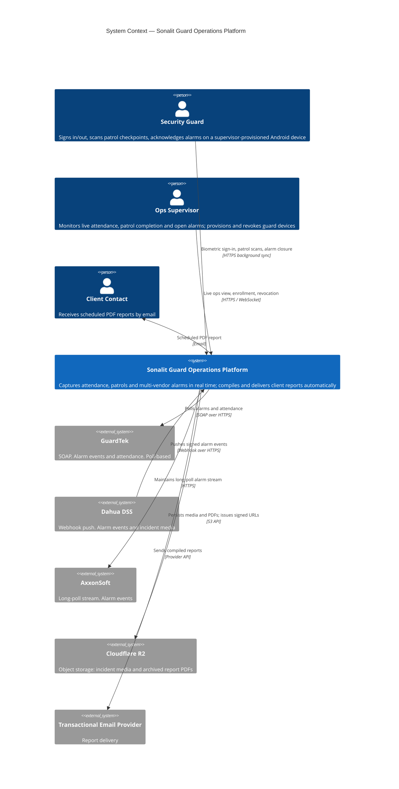
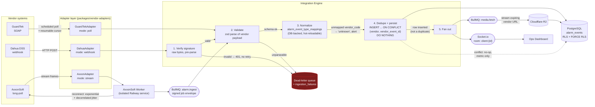

# Sonalit Guard Operations Platform — System Architecture

**Status:** Draft for review · **Phase:** Pre-build (no implementation code written)
**Author:** Principal Systems Architect
**Date:** 2026-07-30

---

## 0. Repository context finding — read this first

This document was produced inside the repository **`fleetsatpro/ultimatefleet`**, on branch
`claude/new-session-fg0j3d`. Before designing anything I inventoried the repository. It contains:

| Path | Contents |
|---|---|
| `package.json` | React 18 + Vite prototype, **not** a pnpm workspace |
| `src/main.jsx`, `FleetOpsPro.jsx` | A ~10-line "Fleet Operations Pro" placeholder component |
| `FleetOpsPro.jsx.txt` | ~124 KB single-file React fleet dashboard (Recharts), not imported by the build |
| `backend/package.json` | Express + `pg` + `redis` stub; the file contains **literal `\n` escape sequences instead of newlines** and is not valid JSON |
| `railway.json` | Contains `"API_KEY": "YOUR_API_KEY_HERE"` committed into the repo |
| `Fleet-Management-enhanced (1).zip` | A CommonJS fleet/GPS/convoy backend with BullMQ workers |

**This is a vehicle-fleet-management prototype. It is not the Sonalit codebase.** That matters
because the brief grounds several instructions in an existing Sonalit platform:

- *"BullMQ — already in use across Sonalit; maintain this pattern"*
- *"Cloudflare R2 — already provisioned"*
- *"The existing Sonalit codebase uses Centrifugo for realtime"*
- *"a session-scoped GUC set via `withClientId()` wrapper — same pattern as `withOrg()` in the main Sonalit platform"*

None of these exist here. I searched the full tree for `centrifugo`, `withOrg`, `sonalit`,
`guardtek`, `dahua`, `axxon`, and `bullmq` across all JS/TS/JSON/MD files: **zero matches** outside
the fleet zip's own BullMQ usage. So I cannot mirror `withOrg()`, cannot confirm R2 is provisioned,
and cannot confirm a shared Centrifugo instance exists.

I have designed against the brief's stated constraints as written and flagged each unverifiable
claim in §12. **Open Item 0 (repository target) is the highest-priority blocker** — see §12.

Two incidental issues found while reading, unrelated to this platform but worth reporting:
`railway.json` commits an `API_KEY` placeholder into version control (env vars belong in Railway's
config, not the repo), and `backend/package.json` is malformed JSON and will fail `npm install`.
I have not modified either file — they are outside this brief's scope.

---

## 1. Divergences from the brief

The brief instructed me to flag divergences explicitly rather than substitute silently. There are
five, and three of them are corrections to errors in the brief itself.

### D1 — The Cockatiel policy snippet in §3 does not compile (**blocking, corrected**)

The brief specifies this exact stack:

```typescript
// FROM THE BRIEF — THIS IS NOT VALID COCKATIEL
const vendorPolicy = wrap(
  handleAll.retry().attempts(3).exponential().jitter(ExponentialBackoff.decorrelatedJitter()),
  handleAll.circuitBreaker().halfOpenAfter(30_000).handle(ConsecutiveBreaker.consecutive(5)),
  handleAll.timeout(10_000),
  handleAll.bulkhead(10)
);
```

This is Polly (.NET) fluent-builder syntax. Cockatiel does not expose a fluent builder on
`handleAll`; its policies are **standalone functions** taking a policy object plus an options
object. `handleAll.retry` is not a function, `ConsecutiveBreaker.consecutive` is not a static
method, and `ExponentialBackoff.decorrelatedJitter` does not exist. The corrected, verified
form is in §8.1. Note also that **decorrelated jitter is already Cockatiel's default backoff
generator**, so the brief's explicit `.jitter(...)` call was redundant as well as invalid.

### D2 — Migration tool: node-pg-migrate, not Drizzle Kit (**decided**)

§9 requires that "every migration must have a `down` function." **Drizzle Kit does not generate
down migrations** — this is a standing, still-unresolved limitation, and the community workaround
is to hand-write reverse SQL as a new forward migration. That is incompatible with the brief's own
requirement. Additionally, our schema needs `ALTER TABLE ... FORCE ROW LEVEL SECURITY`,
`CREATE POLICY`, role `GRANT`s, and partial unique indexes — none of which Drizzle's schema DSL
models, so they would end up as raw SQL escape hatches anyway. **node-pg-migrate** takes raw SQL,
has first-class `up`/`down`, and runs in a transaction per migration.

### D3 — `AlarmAdapter` is refactored from optional-methods to a discriminated union (**proposed**)

The §2.1 draft makes every ingestion method optional (`poll?`, `handleWebhook?`, `start?`). That
means a misconfigured or half-written adapter type-checks fine and then **silently ingests nothing**
at runtime — the worst possible failure mode for an alarm system, because a silent no-op looks
identical to "no alarms occurred." A discriminated union on an ingestion `mode` field forces the
engine to `switch` exhaustively, so a new vendor cannot be added without the compiler demanding it
be wired in. See §6.3.

### D4 — Webhook signature verification needs the raw request body (**proposed, correctness**)

The draft `handleWebhook(payload: unknown, headers)` cannot verify an HMAC signature. `payload` is
parsed JSON; HMAC is computed over the **exact received bytes**. Any re-serialization (key order,
whitespace, unicode escaping) produces a different digest and verification fails — or worse,
someone "fixes" it by skipping verification. The refined contract takes `rawBody: Buffer` and makes
`verifySignature` a separate, independently testable method that runs **before** parsing. See §6.3.

### D5 — Biometric embeddings are stored in PostgreSQL (**scoped exception, justified**)

The brief states, twice and emphatically, *"never store binary data in PostgreSQL."* It then
specifies `guard_enrollments.embedding_vector` (binary, non-reversible). Taken literally these
contradict. Resolution: the rule targets **unbounded media blobs** (photos, PDFs, video) whose
size scales with usage and whose access pattern is "stream to a client once." A face embedding is
a **fixed-size credential** — typically 512 × float32 ≈ 2 KB — and it must live in PostgreSQL
because:

1. It needs **RLS**. R2 has no row-level authorization model; a leaked signed URL is a leaked
   biometric credential.
2. Right-to-erasure needs a **transactional delete** that is atomic with the audit record of the
   erasure. R2 deletes are eventually consistent and cannot participate in a Postgres transaction.
3. Revocation must be **transactional** with enrollment state, on the sign-in critical path.

This is a deliberate, bounded exception: fixed-size credential material in Postgres, all
variable-size media in R2, no raw face image anywhere at any layer.

---

## 2. C4 Context diagram



---

## 3. C4 Container diagram


**Why these service boundaries:**

- **AxxonSoft Worker is its own Railway service** because the brief mandates it, and the mandate is
  correct: a long-lived stream client has an unbounded reconnect lifecycle and a memory profile
  that drifts over days. Co-locating it with ingestion means an Axxon socket leak takes down
  GuardTek and Dahua ingestion too.
- **Report Worker is separate** because Chromium is the largest and least predictable memory
  consumer in the system. A report render OOM must not kill alarm ingestion. It also lets report
  concurrency be tuned independently of HTTP concurrency.
- **The media pipeline is a BullMQ worker inside the Integration Engine**, not its own service, for
  MVP: it is I/O-bound with a small, flat memory profile (stream vendor URL → R2, never buffer the
  whole object). *Split-out trigger:* if media job wait time exceeds 60 s at p95, or media volume
  forces a worker concurrency above ~20, promote it to its own Railway service.

---

## 4. Data flow — alarm ingestion path



**Three properties this flow guarantees:**

1. **Signature verification happens on raw bytes before parsing** (D4). A forged webhook never
   reaches the normalizer.
2. **Fan-out is gated on actual insertion.** `ON CONFLICT DO NOTHING` returns zero rows on a
   duplicate; we fan out only when a row was really written. Without this gate, a vendor redelivering
   the same event 50 times would push 50 dashboard notifications and enqueue 50 media fetches while
   correctly writing only one row.
3. **A single `correlationId`** is minted at the adapter boundary and threaded through every stage,
   into the media job, the report run, and the delivery log.

---

## 5. Technology decisions

| Concern | Choice | Alternatives considered | Reason |
|---|---|---|---|
| Migrations | **node-pg-migrate** | Drizzle Kit | Drizzle Kit generates no `down` migrations, violating §9; we also need raw SQL for `FORCE RLS`, policies, `GRANT`s, partial indexes (D2) |
| DB access | **`pg` + typed repositories, zod row parsing** | Drizzle ORM, Prisma, Kysely | RLS via session GUC demands a dedicated connection inside a transaction. ORM pooling abstractions routinely leak a `SET`-scoped GUC to the next borrower of the connection — a cross-tenant data leak. We own the connection lifecycle explicitly (§7.2) |
| Realtime | **Socket.io + Redis adapter** | Centrifugo, raw WS, SSE | Shared Centrifugo availability is **unconfirmed** (Open Item 7). Socket.io removes an infra dependency from the critical path; we already run Redis for BullMQ, so multi-instance fan-out is free. Load is tens of supervisors, not tens of thousands. *Revisit trigger:* >1,000 concurrent clients, or a second independent realtime consumer appears |
| Mobile local store | **WatermelonDB** | AsyncStorage, raw SQLite, Realm, PowerSync | Per brief; independently verified as the current production standard for offline-first RN at this data volume. Its lazy-loading reactive layer and defined push/pull protocol are what we need, and Migration Syncs handle schema evolution without a full resync |
| PDF rendering | **Playwright + pooled Chromium** | Puppeteer, Browserless, wkhtmltopdf | Playwright's `browser.newContext()` gives per-render isolation without a new process — the cheap middle ground between "fresh browser each time" (banned) and "shared dirty context" (leaks state between clients). Official container image ships fonts, which matters for report fidelity. *Escape hatch:* Browserless if pool ops become a burden |
| Tests | **Vitest + Testcontainers (PostgreSQL)** | Jest, node:test | Vitest handles ESM/TS with no transform config across a 14-package workspace. **RLS cannot be tested against a mock or SQLite** — the acceptance test must run against real PostgreSQL as the real restricted role, which is exactly what Testcontainers gives us in CI |
| Queue | **BullMQ over Redis** | SQS, pg-boss, RabbitMQ | Per brief |
| Object storage | **Cloudflare R2 via S3 API** | S3, Postgres LOB | Per brief; `@aws-sdk/lib-storage` for streaming multipart uploads so we never buffer a full object in memory |
| Env validation | **zod at startup, fail hard** | envalid, manual | Per brief; one `parse()` per service, no defaults for required vars |
| Service auth | **HS256 JWT, short TTL, `kid`-based rotation** | mTLS, raw shared secret | See §9.3 |
| Dashboard sessions | **Server-side sessions in Redis** | JWT | See §9.2 |

---

## 6. Refined interface contracts

These supersede the §2.1 drafts. Every change is justified; nothing is changed silently.

### 6.1 `exactOptionalPropertyTypes` forces explicit `| undefined`

With `"exactOptionalPropertyTypes": true` (mandated by §9), `latency_ms?: number` accepts an
*absent* property but **rejects** `latency_ms: undefined`. That breaks the natural way health
objects get built:

```typescript
// Fails to compile under exactOptionalPropertyTypes with `latency_ms?: number`
return { vendor, status, latency_ms: didMeasure ? ms : undefined };
```

Every genuinely-optional field that may be constructed as `undefined` is therefore declared
`?: T | undefined`. This is a deliberate, required consequence of the brief's own compiler settings.

### 6.2 Core event types

```typescript
export type VendorId = 'guardtek' | 'dahua' | 'axxon';

export type NormalizedEventType =
  | 'intrusion' | 'motion' | 'door_forced' | 'door_open'
  | 'fire' | 'panic' | 'tamper' | 'connection_loss' | 'unknown';

export type AlarmSeverity = 'low' | 'medium' | 'high' | 'critical';

/** A vendor media reference. Vendor URLs expire; the pipeline prioritises by deadline. */
export interface MediaRef {
  readonly url: string;
  readonly kind: 'image' | 'video' | 'unknown';
  /** Vendor-stated expiry, when the vendor states one. UNVERIFIED per vendor. */
  readonly expires_at?: Date | undefined;
}

export interface NormalizedAlarmEvent {
  readonly internal_id: string;          // UUID v7, generated on ingestion
  readonly vendor: VendorId;
  readonly vendor_event_id: string;      // idempotency key
  readonly client_id: string;
  readonly site_id: string;
  readonly event_type: NormalizedEventType;
  readonly severity: AlarmSeverity;
  readonly occurred_at: Date;
  readonly received_at: Date;
  readonly raw_payload: unknown;         // JSONB — never dropped
  readonly media_urls: readonly MediaRef[];
  /** ADDED: threads ingestion → persistence → dashboard → report → delivery (§3 observability). */
  readonly correlation_id: string;
  /** ADDED: null when the vendor_code had no mapping row; drives the unmapped-code alert. */
  readonly vendor_event_code: string | null;
}
```

**Three additions, each justified:**

- `correlation_id` — §3 requires correlation IDs threaded through the full path. The draft event had
  nowhere to carry one, so the requirement was unsatisfiable as specified.
- `vendor_event_code` — when a Dahua code is unmapped we fall back to `'unknown'`. Without
  retaining the original code, the "new event code appeared" alert cannot name the code, and the
  supervisor cannot add the mapping row. Recoverable from `raw_payload` in principle, but that
  requires vendor-specific parsing in an alerting path that must stay vendor-agnostic.
- `media_urls` as `MediaRef[]` rather than `string[]` — a bare string loses the expiry deadline, so
  the media pipeline cannot prioritise the URL that expires in 60 s over the one that expires in an
  hour. Whether each vendor actually states an expiry is **unverified** (Open Items 1–3), hence
  optional.

`internal_id` is **UUID v7** rather than v4: it is time-ordered, so it clusters on insert instead of
scattering B-tree writes across the index, and it gives a natural tiebreaker for equal
`occurred_at` values in dashboard pagination.

### 6.3 Adapter contracts — discriminated union (D3 + D4)

```typescript
export interface AdapterHealth {
  readonly vendor: VendorId;
  readonly status: 'connected' | 'degraded' | 'offline';
  readonly latency_ms?: number | undefined;
  readonly last_event_at?: Date | undefined;
  readonly error?: string | undefined;
  /** ADDED: exported per vendor as a metric; alert if open > 60s (§3 resiliency). */
  readonly breaker_state: 'closed' | 'open' | 'half-open';
}

export type IngestionMode = 'poll' | 'webhook' | 'stream';

interface AlarmAdapterBase {
  readonly vendor: VendorId;
  readonly mode: IngestionMode;
  healthCheck(): Promise<AdapterHealth>;
}

/** Opaque, vendor-defined resume point. Persisted in `alarm_sources.poll_cursor`. */
export type PollCursor = { readonly value: string } | null;

export interface PollingAlarmAdapter extends AlarmAdapterBase {
  readonly mode: 'poll';
  /** Yields events, returns the cursor to persist for the next run. */
  poll(cursor: PollCursor, signal: AbortSignal):
    AsyncGenerator<NormalizedAlarmEvent, PollCursor, void>;
}

export type SignatureVerdict =
  | { readonly ok: true }
  | { readonly ok: false; readonly reason: string };

export interface WebhookAlarmAdapter extends AlarmAdapterBase {
  readonly mode: 'webhook';
  /** MUST run on raw bytes before any parse (D4). */
  verifySignature(rawBody: Buffer, headers: Readonly<Record<string, string>>): SignatureVerdict;
  handleWebhook(rawBody: Buffer, headers: Readonly<Record<string, string>>):
    Promise<readonly NormalizedAlarmEvent[]>;
}

export type Unsubscribe = () => void;

export interface StreamAlarmAdapter extends AlarmAdapterBase {
  readonly mode: 'stream';
  start(signal: AbortSignal): Promise<void>;
  stop(): Promise<void>;
  onAlarm(listener: (e: NormalizedAlarmEvent) => void): Unsubscribe;
}

export type AlarmAdapter = PollingAlarmAdapter | WebhookAlarmAdapter | StreamAlarmAdapter;
```

**Why each change:**

- **Union over optional methods (D3).** The engine dispatches with an exhaustive `switch` on
  `adapter.mode` plus a `never` guard in the default branch. Adding a fourth vendor with a new
  ingestion style is then a **compile error** until it is wired in, instead of a silent no-op.
- **`poll` takes and returns a cursor.** The draft `poll()` had no resume point, so an adapter must
  either re-fetch all history every run or hide cursor state internally — untestable, and lost on
  every Railway redeploy. An explicit cursor persisted in `alarm_sources` makes polling resumable
  and deterministic in tests.
- **`AbortSignal` on `poll`/`start`.** Railway sends `SIGTERM` on redeploy. Without a cancellation
  path, an in-flight poll or stream read is killed mid-write. Cockatiel's `execute` already hands us
  a signal; we propagate it.
- **`onAlarm` returns `Unsubscribe`, not `this`.** The draft's `on(): this` is the EventEmitter
  idiom, and in a process whose whole job is reconnecting forever it is a listener leak: every
  reconnect adds a handler that nothing removes. Returning an unsubscribe makes teardown mandatory
  and reviewable — which is the entire reason the brief isolates this worker.
- **`breaker_state` on `AdapterHealth`.** §3 and §6 both require per-vendor breaker state on the
  dashboard; the draft health type had no field for it.

### 6.4 Attendance

```typescript
export interface NormalizedAttendanceRecord {
  readonly vendor_record_id: string;
  readonly guard_id: string | null;   // null until matched to an internal guard
  readonly site_id: string;
  readonly client_id: string;
  readonly event_type: 'sign_in' | 'sign_out';
  readonly occurred_at: Date;
  readonly raw_payload: unknown;
  readonly correlation_id: string;
}

export interface AttendanceSource {
  readonly vendor: VendorId;
  fetchAttendance(
    siteId: string, from: Date, to: Date, signal: AbortSignal,
  ): Promise<readonly NormalizedAttendanceRecord[]>;
}
```

`guard_id?: string` became `guard_id: string | null`. The draft's optional-property form makes
"unmatched" indistinguishable from "the adapter forgot to set it" — and under
`exactOptionalPropertyTypes` you cannot even write `guard_id: undefined` explicitly. An explicit
`null` makes unmatched a value the code must handle.

---

## 7. Multi-tenancy and data isolation

### 7.1 Model

Shared-schema PostgreSQL. Every tenant-scoped table carries `client_id uuid not null`, has RLS
enabled **and forced**, and a policy filtering on the `app.current_client_id` GUC:

```sql
ALTER TABLE alarm_events ENABLE ROW LEVEL SECURITY;
ALTER TABLE alarm_events FORCE  ROW LEVEL SECURITY;   -- removes the table-owner bypass

CREATE POLICY tenant_isolation ON alarm_events
  USING      (client_id = current_setting('app.current_client_id', true)::uuid)
  WITH CHECK (client_id = current_setting('app.current_client_id', true)::uuid);
```

`WITH CHECK` matters as much as `USING`: without it, a tenant can *read* only its own rows but can
still *insert* a row stamped with someone else's `client_id`.

`current_setting(..., true)` returns NULL rather than erroring when the GUC is unset, and
`client_id = NULL` is NULL — never true. So **a missing GUC yields zero rows, not all rows**. Fail
closed.

Three roles, with a hard separation the brief demands:

| Role | Owns tables | RLS applies | Used by |
|---|---|---|---|
| `sonalit_owner` | yes | forced (D-bypass removed) | **migrations only** — credential lives solely in the Railway pre-deploy job |
| `sonalit_app` | no | yes | every application query path |
| `sonalit_readonly` | no | yes | ad-hoc investigation |

`FORCE ROW LEVEL SECURITY` is applied even to the owner. It is the single most commonly missed step
in production RLS, and the reason is subtle: developers test isolation while connected as the owner,
see policies "working" because they happen to filter correctly, and never notice the owner was
bypassing them all along. The Phase 1 acceptance test asserts this explicitly (§Phase 1).

### 7.2 `withClientId()` — and the pooling hazard it exists to prevent

```typescript
export async function withClientId<T>(
  clientId: string,
  fn: (tx: TenantTransaction) => Promise<T>,
): Promise<T> {
  const client = await pool.connect();          // dedicated connection
  try {
    await client.query('BEGIN');
    // `true` = transaction-local. Reverts on COMMIT/ROLLBACK, cannot outlive the transaction.
    await client.query('SELECT set_config($1, $2, true)', ['app.current_client_id', clientId]);
    const result = await fn(wrap(client));
    await client.query('COMMIT');
    return result;
  } catch (err) {
    await client.query('ROLLBACK').catch(() => { /* connection already broken; release below */ });
    throw err;
  } finally {
    client.release();
  }
}
```

Three non-obvious details, all of which are cross-tenant leak vectors if got wrong:

1. **`set_config(..., true)` — transaction-local, not session-local.** With `SET` (session-level)
   or `set_config(..., false)`, the GUC survives `client.release()` and is still set for whichever
   request borrows that connection next. That request then reads *the previous tenant's* rows. This
   is the exact failure mode that rules out ORM abstractions which hide connection checkout.
2. **Always inside a transaction.** Transaction-local scoping requires a transaction; without
   `BEGIN` the setting has nothing to be scoped to.
3. **The tenant context is a parameter, never a default.** There is no ambient "current client"
   global. Untenanted access is only possible through a separate, explicitly named
   `withGlobalConfig()` helper used solely for `alarm_event_type_mappings`.

Enforcement: the raw pool is not exported from `@sonalit/db`. Application code physically cannot
obtain a connection except through `withClientId()` or `withGlobalConfig()`, backed by an ESLint
`no-restricted-imports` rule on deep paths.

---

## 8. Resiliency

### 8.1 Corrected Cockatiel policy stack (see D1)

```typescript
import {
  bulkhead, circuitBreaker, CircuitState, ConsecutiveBreaker,
  ExponentialBackoff, handleAll, retry, timeout, TimeoutStrategy, wrap,
} from 'cockatiel';

export function createVendorPolicy(vendor: VendorId, metrics: Metrics, log: Logger) {
  const breaker = circuitBreaker(handleAll, {
    halfOpenAfter: 30_000,
    breaker: new ConsecutiveBreaker(5),
  });

  // Export breaker state as a metric, and alert on a breaker stuck open (§3).
  let openedAt: number | null = null;
  breaker.onStateChange((state) => {
    metrics.gauge('vendor_breaker_state', stateToNumber(state), { vendor });
    if (state === CircuitState.Open) {
      openedAt = Date.now();
      // Alert, do not merely log: a silently-open breaker serving degraded data
      // is a worse failure mode than a visible outage.
      alerts.fire('vendor_breaker_open', { vendor, severity: 'warning' });
    } else if (openedAt !== null) {
      metrics.histogram('vendor_breaker_open_duration_ms', Date.now() - openedAt, { vendor });
      openedAt = null;
    }
  });

  return wrap(
    // Decorrelated jitter is ExponentialBackoff's DEFAULT generator — verified.
    retry(handleAll, { maxAttempts: 3, backoff: new ExponentialBackoff() }),
    breaker,
    timeout(10_000, TimeoutStrategy.Aggressive),
    bulkhead(10),
  );
}
```

`wrap`'s first argument is the **outermost** policy, so ordering reads retry → breaker → timeout →
bulkhead. That ordering is deliberate: the timeout sits *inside* the breaker so a timed-out call
counts as a breaker failure (a hanging vendor must be able to trip the circuit), and the bulkhead
sits innermost so time spent queued for a concurrency slot is charged against the same 10 s budget
rather than added on top of it.

The "breaker open > 60 s" alert is a **separate periodic check** over the exported gauge, not a
`setTimeout` inside the state-change handler — a timer would be lost on redeploy, which is exactly
when breakers are most likely to be open.

### 8.2 Partial failure isolation, enforced not just documented

`Promise.all` is banned in any path where partial failure should be isolated. A convention nobody
can enforce is not a control, so this becomes a lint rule:

```json
{
  "rules": {
    "no-restricted-syntax": ["error", {
      "selector": "MemberExpression[object.name='Promise'][property.name='all']",
      "message": "Promise.all is banned: partial failure must be isolated. Use Promise.allSettled with explicit rejection handling."
    }]
  }
}
```

At report time, per-source fetches run under `Promise.allSettled`; a rejected source marks that
client's report `partial` with structured error detail and **that client only**. Other clients'
reports proceed untouched.

---

## 9. Authentication and authorization

### 9.1 Guard mobile — short-lived JWT + device-bound rotating refresh token

**Decision:** 15-minute access JWT; opaque refresh token bound to `guard_enrollments.device_id`,
stored in Android Keystore-backed storage, rotated on every use with reuse detection.

Rejected: a long-lived device-bound token. It cannot be revoked without a server-side blocklist
checked on every request — which is a DB round trip per request, i.e. exactly the cost the
long-lived token was supposed to avoid, plus a new failure mode.

The refresh endpoint re-checks enrollment on **every** refresh:

```sql
SELECT 1 FROM guard_enrollments
 WHERE device_id = $1 AND guard_id = $2 AND revoked_at IS NULL;
```

No row → refresh rejected, token family invalidated. This is what satisfies "refresh must be
rejected if enrollment is revoked" and bounds revocation propagation to one refresh cycle (≤15 min
online) or the guard's next connection.

**Rotation with reuse detection:** each refresh issues a new token and marks its predecessor
consumed. Presenting a consumed token invalidates the whole family and forces re-provisioning —
this is what catches a cloned device replaying a stolen refresh token.

**The offline interaction the brief does not address.** A 15-minute token looks incompatible with
"guard works a full 12-hour shift with no signal." It is not, because of how the offline model is
layered: **local writes never require a valid token.** WatermelonDB is the on-device source of
truth; sign-in, patrol scans, and alarm closures are written locally and authorized locally against
the cached enrollment record. Only *sync* needs a live token. A guard can work an entire shift with
a long-expired access token and sync on return to coverage. Access-token TTL therefore constrains
sync latency, never the guard's ability to work — and this is precisely why revocation is specified
to propagate "within one sync cycle" rather than instantly. Offline revocation is impossible by
construction and must be an accepted, documented risk.

**Requires client sign-off:** the maximum acceptable window during which a revoked guard can keep
recording events offline. This is a security policy question, not a technical one. Default proposal:
refuse to accept synced events whose local timestamp is after the server's `revoked_at`, and flag
them for supervisor review rather than dropping them — the audit trail is permanent.

### 9.2 Ops dashboard — server-side sessions in Redis

**Decision:** email + password (Argon2id), opaque session ID in an `httpOnly`, `Secure`,
`SameSite=Lax` cookie, session state in Redis with sliding 8-hour expiry.

Rejected: JWT. For a browser admin tool, a stateless JWT means logout cannot actually revoke a
session — the token stays valid until expiry. When a supervisor is dismissed, "revoked but valid for
another 15 minutes" is not acceptable for a tool that can revoke guard access and read all tenants'
alarm data. We already run Redis, so server-side sessions cost no new infrastructure and buy
immediate revocation.

`SameSite=Lax` with a cross-origin dashboard (Vercel) → API (Railway) requires the API to be served
from a **same-site subdomain** (e.g. `api.sonalit.co.ke` with the dashboard at
`ops.sonalit.co.ke`). Otherwise the cookie is third-party and needs `SameSite=None`, which reopens
CSRF exposure. **Open Item 11 (new): DNS/domain plan.** If a same-site domain is unavailable, the
fallback is `SameSite=None; Secure` plus a double-submit CSRF token.

**RBAC:** `role` on the `users` table, enum `admin | supervisor | report_viewer`, checked in
middleware. Roles are coarse and deliberately so; RLS remains the database-enforced backstop
independent of role checks. `admin` may cross tenants (Sonalit staff); `supervisor` and
`report_viewer` are pinned to their `client_id`.

**SSO/SAML: deferred, out of MVP scope.** Flagged for the client: if any enterprise client requires
SSO at contract signature, this moves into scope and the session design absorbs it cleanly (SAML
assertion → same server-side session), which is a further argument against JWT.

### 9.3 Service-to-service — HS256 JWT with `kid` rotation

**Decision:** each internal service holds a per-service HMAC secret from Railway env vars and mints
short-lived (5-minute) HS256 JWTs with `iss` = service name, `aud` = target service, `kid` = key
generation.

Rejected **mTLS**: Railway gives us no certificate lifecycle management, so we would be operating a
private CA — high effort, and an expired cert is a total outage. Rejected a **raw shared HMAC
header**: a captured header is replayable forever; a JWT's `exp` and `aud` bound both the window and
the target.

**Rotation:** services verify against `SVC_SECRET_CURRENT` *and* `SVC_SECRET_PREVIOUS`, sign only
with current. Rotation is: set previous ← current, set current ← new, redeploy. No coordinated
restart, no outage window.

**The queue is an auth boundary too.** The brief mandates BullMQ between the AxxonSoft worker and
the engine and forbids direct HTTP — so HTTP-level auth covers none of that traffic. A job on a
shared Redis instance bypasses HTTP entirely. Therefore **every internal job payload is wrapped in
a signed envelope** and verified by the consumer before processing:

```typescript
interface SignedJobEnvelope<T> {
  readonly payload: T;
  readonly iss: 'axxon-worker' | 'integration-engine' | 'report-worker';
  readonly iat: number;
  readonly kid: string;
  readonly sig: string;   // HMAC-SHA256 over canonical JSON of {payload, iss, iat}
}
```

This is the concrete form of "do not assume network position is a trust boundary."

**Railway private networking detail (verified):** services communicate over
`<service-name>.railway.internal`, and a service must bind to `::` to be reachable on the private
network — legacy environments (created before 2025-10-16) are IPv6-only, while newer environments
support both. Binding to `0.0.0.0` yields a service that is silently unreachable internally. This
belongs in the Phase 1 service template, not discovered during the first deploy.

---

## 10. Biometric architecture — Components A and B

| | Component A — liveness gate | Component B — identity match |
|---|---|---|
| Question answered | "Is a live authorized human holding this device?" | "Is this guard X, not guard Y with X's phone?" |
| Mechanism | Platform biometric prompt (`BiometricPrompt`) | Dedicated 1:1 face-match SDK, on-device |
| Artifact | Boolean + timestamp | Similarity score + threshold + SDK/version |
| Failure mode | Fall back to device PIN; flag the event | Hard fail; supervisor override required, logged |
| Stored | Nothing (OS-owned) | Score only (per event); embedding once (per enrollment) |

They are separate modules with separate fallbacks. A passes and B fails ⇒ someone else is holding
an authorized device: the highest-value signal in the system, and conflating the two throws it away.

**Where matching happens: on-device.** The server never receives a face image or performs matching.
The canonical embedding is held server-side in `guard_enrollments` (needed for re-provisioning after
device replacement, and for transactional revocation) and a copy is provisioned to the device into
Keystore-wrapped encrypted storage at enrollment. Sign-in computes the match locally and transmits
`{ score, threshold, sdk, sdk_version, decision }`. Verified property: **the source face image
never leaves the device**, and no raw image is stored at any layer.

**Threshold policy requires client sign-off.** The false-accept/false-reject tradeoff is a business
risk decision (a false reject strands a guard at a gate at 03:00; a false accept defeats the
control). It must be a DB-configured value with an audit trail of changes, never a hardcoded
constant.

### 10.1 Kenya DPA 2019 — a verified schedule dependency, not just a checkbox

I verified the compliance position rather than assuming it. Two findings materially affect the plan:

1. **Registration with the ODPC is mandatory** — no person may act as a data controller or
   processor without registering with the Data Commissioner, and the thresholds under the Data
   Protection (Registration of Data Controllers and Data Processors) Regulations 2021 turn on
   industry, data volume, and specifically whether **sensitive personal data** is processed.
   Biometric data is expressly sensitive personal data under the Act.
2. **A DPIA is required and must be filed 60 days in advance.** Section 31 requires a DPIA before
   processing likely to result in high risk — which covers large-scale sensitive-data processing and
   systematic monitoring, i.e. this system twice over. Reported guidance is that **DPIAs must be
   submitted to the Data Commissioner at least 60 days before processing begins.**

**This is a hard, ≥60-day lead time on the critical path to biometric enrollment (Phase 9).** It is
not a compliance checkbox to tidy up at the end — if the DPIA is filed when Phase 9 starts, Phase 9
stalls for two months. The plan therefore starts the compliance track **in parallel with Phase 1**
(§Phase 1 of the plan document, Track C).

I am not a lawyer and these findings come from secondary sources. They need confirmation against
current ODPC guidance by Kenyan counsel — that confirmation is itself Open Item 6. What I can state
with confidence is the shape of the risk: **treat it as a two-month lead time until counsel says
otherwise.** Phase 1 is not blocked by it; Phase 9 is hard-gated on it in writing.

---

## 11. Data model and indexing rationale

Full DDL ships in Phase 1. The reasoning, per the brief's requirement to explain indexing before
implementing:

### 11.1 Idempotency constraints — one per ingestion path

| Table | Unique constraint | Guards against |
|---|---|---|
| `alarm_events` | `(vendor, vendor_event_id)` | Vendor redelivery, poll overlap, stream reconnect replay |
| `shift_attendance` | `(device_id, client_event_id)` | Mobile sync retry after a lost response |
| `patrol_scans` | `(device_id, client_event_id)` | Same |
| `alarm_event_type_mappings` | `(vendor, vendor_code)` | Duplicate config rows |

These are **constraints, not just indexes** — `ON CONFLICT` requires a real unique constraint or
index to infer against.

`client_event_id` is a UUID minted **on the device** when the event is written locally. This is what
makes offline sync idempotent: the phone loses the response to a sync POST, retries, and the second
insert conflicts harmlessly. Without a device-generated ID there is no way to tell a retry from a
genuine second scan at the same checkpoint.

Note `alarm_events`' key deliberately excludes `client_id`: vendor event IDs are unique per vendor,
and including `client_id` would let a client-resolution bug insert the same vendor event twice under
two tenants.

### 11.2 Indexes, driven by actual query patterns

Every tenant-scoped composite index leads with `client_id` — required by the brief, and correct
regardless, because the RLS policy adds `client_id = ...` to *every* query, so a non-leading
`client_id` cannot be used for that predicate.

| Query pattern | Index | Why |
|---|---|---|
| Dashboard: recent events at a site | `(client_id, site_id, occurred_at DESC)` | Exactly matches the RLS predicate + filter + sort; index-only ordering, no sort node |
| Dashboard: **open** alarms | `(client_id, site_id, occurred_at DESC) WHERE closed_at IS NULL` | **Partial.** Open alarms are a tiny fraction of a growing table but the hottest query — the index stays small and fully cached while `alarm_events` grows without bound |
| Report: per-client aggregation over a period | `(client_id, occurred_at)` | Range scan; no `site_id`, which would force a scan per site |
| Dedupe on insert | `(vendor, vendor_event_id)` UNIQUE | `ON CONFLICT` inference target |
| Per-guard attendance history | `(client_id, guard_id, occurred_at DESC)` | Guard timeline view |
| Report queue monitoring | `(status, created_at)` on `report_runs` | Not tenant-scoped: this is Sonalit's own ops view across all clients |
| Delivery audit | `(report_run_id)`, `(delivery_status, created_at DESC)` | Per-run lookup; failed-delivery sweep |

**Deliberately absent: a GIN index on `raw_payload`.** It is an audit artifact and adapter-debugging
source, not an operational query target. GIN on a JSONB column written on every ingestion adds
material write amplification to the hottest write path in the system to serve queries we do not
make. *Add-it trigger:* recurring adapter investigations that actually filter inside the payload.

**Partitioning is deferred, with an explicit trigger.** Monthly range partitions on
`alarm_events.occurred_at` become worthwhile past roughly 50 M rows. Two interactions to plan for
before then, both of which are easier to design for now than to retrofit: a unique constraint on a
partitioned table **must include the partition key**, which would change the dedupe key from
`(vendor, vendor_event_id)` to include `occurred_at` and thereby weaken it; and RLS policies must be
declared per-partition or inherited from the parent. Flagged so the decision is made deliberately.

### 11.3 Append-only event tables

`shift_attendance`, `patrol_scans`, and alarm closures are **immutable event logs**, not mutable
state. An alarm closure is an inserted `alarm_closures` row, not an `UPDATE` on `alarm_events`.
The brief's reasoning is right and worth restating: with last-write-wins state, two devices
reporting near-simultaneously silently destroy attendance history — and in a security-services
product where auditability is the sellable feature, silent history loss is a product defect, not a
data-quality nit. `alarm_events.closed_at` is therefore a **derived** column maintained from the
closure log for the partial index, never the source of truth.

### 11.4 Right-to-erasure without breaking the audit trail

Three independent lifecycle operations, which is what the brief's requirement actually demands:

| Operation | Effect | Audit impact |
|---|---|---|
| **Revoke** (`revoked_at = now()`) | Blocks future sign-ins immediately | None — record retained |
| **Erase biometric** (`embedding_vector = NULL`, `erased_at = now()`) | Embedding destroyed; guard cannot re-enroll without a new enrollment | None — event records untouched |
| **Delete guard** | Not supported | N/A |

`embedding_vector` is nullable specifically so erasure is a column update, not a row delete. Since
`guard_enrollments` is FK-referenced by nothing in the event tables (events carry `guard_id`, which
points at `guards`), erasing an embedding cannot cascade into event history. That is the schema
property that makes right-to-erasure and permanent audit coexist — and it is a deliberate design
choice, not an accident of the FK graph.

---

## 12. Unverified assumptions and open items

Ordered by blocking severity. Items 0 and 11 are new findings from this analysis.

| # | Item | Status | Blocks | Owner |
|---|---|---|---|---|
| **0** | **Repository target.** This repo is an unrelated fleet-management prototype (§0). Does the platform go here (monorepo at root, prototype moved to `legacy/`), or in a new repo? | **Unresolved — blocks all implementation** | Everything | Griff |
| 1 | GuardTek WSDL, endpoint, auth credentials | Unresolved | GuardTek adapter body | Client / GuardTek |
| 2 | Dahua DSS webhook docs + signature scheme | Unresolved | Dahua adapter body | Client / Dahua |
| 3 | AxxonSoft stream endpoint docs | Unresolved | Axxon adapter body | Client / AxxonSoft |
| 4 | Target Android OS version range | Unresolved | Biometric SDK selection | Client |
| 5 | Face SDK selection (FaceOnLive / Faceplugin / Regula / FaceTec) | Unresolved | Phase 9 | Griff / Client |
| 6 | **Kenya DPA: ODPC registration + DPIA.** Verified as mandatory with a **≥60-day pre-filing lead time** (§10.1). Must be confirmed by Kenyan counsel | **Unresolved — start now, ≥60d lead** | Phase 9 (hard gate) | Client + Legal |
| 7 | Shared Centrifugo instance availability | Unresolved → **Socket.io chosen** so this stops blocking | Nothing (decided) | Griff |
| 8 | Observability backend the team actually runs | Unresolved → Railway log drain for MVP, OTel as upgrade path | Nothing (decided) | Team |
| 9 | Face-match similarity threshold per site/client | Unresolved | Phase 9 | Client (risk decision) |
| 10 | Max acceptable offline window for a revoked guard (§9.1) | Unresolved | Phase 8 sync policy | Client (security policy) |
| **11** | **DNS/domain plan.** Same-site API subdomain needed for `SameSite=Lax` session cookies (§9.2); otherwise fallback to `SameSite=None` + CSRF tokens | **Unresolved** | Phase 7 | Griff |
| 12 | R2 bucket actually provisioned + credentials | **Unverifiable here** (§0) | Phase 5 | Griff |
| 13 | Transactional email provider choice + verified sending domain | Unresolved | Phase 11 | Griff |

**Assumptions I am proceeding on, stated so they can be corrected:**

- Scale is tens of sites, hundreds of guards, thousands of alarm events/day — not millions. This
  underpins "no partitioning yet," "Socket.io over Centrifugo," and "Postgres without read
  replicas." **If actual volume is an order of magnitude higher, revisit all three.**
- One Railway environment per stage (dev/staging/prod), one Postgres per environment.
- Guard devices are Sonalit-owned and supervisor-provisioned, not BYOD. BYOD would change the
  device-binding threat model substantially.
- Report schedules are per-client and at most daily.
