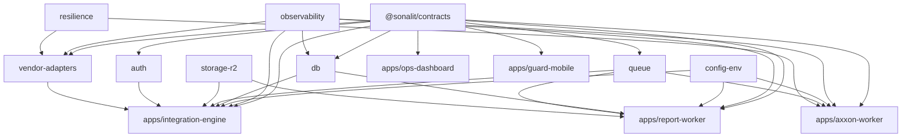

# Repository Structure — Sonalit Guard Operations Platform

**Companion to:** `01-ARCHITECTURE.md` · **Status:** Draft for review

---

## 0. Placement decision required (Open Item 0)

This repository currently holds an unrelated vehicle-fleet-management prototype (see
`01-ARCHITECTURE.md` §0). Two options, and I need a decision before writing code:

**Option A — monorepo at the root of this repo (recommended).**
Move the existing prototype to `legacy/fleetopspro/` untouched, and establish the workspace at the
root. Keeps the `fleetsatpro` org's Codespaces and Railway/Vercel project links intact, and nothing
is deleted.

**Option B — a new repository, `fleetsatpro/sonalit-guard-ops`.**
Cleanest history and no ambiguity about what the repo is, at the cost of re-establishing
Codespaces/Railway/Vercel wiring.

I recommend **A** — the wiring already exists in `fleetsatpro`, and the prototype is small enough to
relocate in one commit. **I have not moved or deleted anything.** The layout below assumes A;
under B it is identical minus `legacy/`.

---

## 1. Layout

```
.
├── pnpm-workspace.yaml
├── package.json                     # root: scripts only, no runtime deps
├── tsconfig.base.json               # strict + noUncheckedIndexedAccess + exactOptionalPropertyTypes
├── .nvmrc                           # 22
├── .github/workflows/ci.yml
├── docs/
│   └── architecture/                # this document set
├── legacy/
│   └── fleetopspro/                 # existing prototype, relocated untouched (Option A)
│
├── apps/                            # deployable units — one per Railway service / Vercel project
│   ├── integration-engine/          @sonalit/integration-engine
│   ├── axxon-worker/                @sonalit/axxon-worker
│   ├── report-worker/               @sonalit/report-worker
│   ├── ops-dashboard/               @sonalit/ops-dashboard
│   └── guard-mobile/                @sonalit/guard-mobile
│
└── packages/                        # never deployed, always imported
    ├── contracts/                   @sonalit/contracts
    ├── db/                          @sonalit/db
    ├── vendor-adapters/             @sonalit/vendor-adapters
    ├── resilience/                  @sonalit/resilience
    ├── observability/               @sonalit/observability
    ├── queue/                       @sonalit/queue
    ├── storage-r2/                  @sonalit/storage-r2
    ├── auth/                        @sonalit/auth
    ├── config-env/                  @sonalit/config-env
    ├── test-support/                @sonalit/test-support
    └── eslint-config/               @sonalit/eslint-config
```

### The `apps/` vs `packages/` rule

Two invariants, both mechanically checkable in CI rather than left to reviewer memory:

1. **Nothing in `packages/` has a `start` script.** If it can be started, it is an app.
2. **Nothing in `apps/` is imported by another workspace member.** If it is imported, it is a package.

Violating either produces the classic monorepo failure where a "shared library" quietly acquires a
server and two deployment targets start sharing process state.

---

## 2. What lives where, and why

### `apps/integration-engine` — the only public HTTP surface

```
src/
├── index.ts                  # env parse → migrations check → bind '::' → listen
├── http/
│   ├── webhooks/dahua.ts     # express.raw() — raw Buffer preserved for HMAC (D4)
│   ├── sync/                 # mobile push/pull endpoints (WatermelonDB protocol)
│   ├── admin/mappings.ts     # POST /admin/mappings/reload — hot-reload, no restart
│   └── health.ts             # per-vendor health + breaker state
├── ingestion/
│   ├── pipeline.ts           # validate → normalize → dedupe → fan out
│   ├── dispatcher.ts         # exhaustive switch on adapter.mode + never guard
│   └── mapping-cache.ts      # alarm_event_type_mappings, loaded at boot, reloadable
├── realtime/socket.ts        # Socket.io + Redis adapter; room per client:{id}
├── workers/media.ts          # BullMQ: vendor URL → R2 stream
└── scheduler/poll.ts         # BullMQ repeatable jobs driving poll-mode adapters
```

The Dahua webhook route **must** be mounted with `express.raw({ type: '*/*' })`, not
`express.json()`. Under `express.json()` the raw bytes are consumed and discarded, and HMAC
verification becomes impossible (D4). This is a one-line mistake that silently disables signature
verification, so it gets a dedicated regression test rather than a code comment.

### `apps/axxon-worker` — isolated by mandate

No HTTP server beyond a `/health` endpoint. Its whole job: hold the long-poll connection, reconnect
with exponential backoff + decorrelated jitter **from the first failed attempt**, and publish signed
alarm jobs to BullMQ. It never touches PostgreSQL — persistence is the engine's responsibility, so
the worker holds no DB credentials at all, which is a meaningful blast-radius reduction for the
service most exposed to a flaky third party.

### `apps/report-worker` — Chromium pool

```
src/
├── pool.ts        # bounded Playwright pool; recycle browser after N=50 renders
├── aggregate.ts   # Promise.allSettled per data source → partial | stale_data | complete
├── render.ts      # HTML/CSS template → PDF via browser.newContext()
├── archive.ts     # PDF → R2, key recorded on report_runs
└── deliver.ts     # email attempt → report_delivery_log (independent of report_runs)
```

`newContext()` per render rather than a new browser gives isolation between clients' reports without
paying process-spawn cost. Browser recycling after N renders bounds Chromium's slow memory creep;
a hard RSS ceiling forces recycle early if a pathological template inflates one render.

### `apps/ops-dashboard` — Vercel

React 18 + Vite. Vercel project root is `apps/ops-dashboard`. Talks to the engine over HTTPS +
WebSocket. Information density over polish, per §6 of the brief.

### `apps/guard-mobile` — React Native, Android only

```
src/
├── db/            # WatermelonDB schema, models, migrations
├── sync/          # pullChanges / pushChanges against the engine
├── auth/          # enrollment token flow; Keystore-backed refresh token
├── biometric/
│   ├── liveness.ts   # Component A — platform BiometricPrompt
│   └── identity.ts   # Component B — 1:1 face match SDK (behind an interface)
└── features/      # sign-in, patrol scan (NFC/QR), alarm ack
```

Components A and B live in **separate directories with separate interfaces** — the physical layout
enforces the architectural separation the brief calls a defect to conflate. Component B sits behind
a `FaceMatcher` interface precisely because the SDK is unselected (Open Item 5); the app is written
against the interface so SDK selection does not ripple through feature code.

### `packages/contracts` — the shared vocabulary

Types **and** zod schemas from `01-ARCHITECTURE.md` §6. Zero runtime dependencies beyond `zod`, and
crucially **no Node built-ins**, because React Native imports this package. A stray `import crypto`
here breaks the mobile bundler with an error that points nowhere near the cause.

Types and validators live together deliberately: a type without a validator gets trusted at an I/O
boundary, which is how `unknown` vendor payloads become runtime crashes three layers in.

### `packages/db` — the only path to PostgreSQL

```
src/
├── pool.ts          # NOT exported from the package index
├── with-client.ts   # withClientId() — the tenant-scoped entry point
├── with-global.ts   # withGlobalConfig() — for alarm_event_type_mappings only
└── repositories/    # typed query functions, zod-parsed rows
migrations/          # node-pg-migrate, up + down per file
seeds/               # deterministic fixtures: 2 clients, 3 sites, 4 guards
```

`pool.ts` is deliberately absent from the package index. Application code **cannot** obtain a raw
connection, so it cannot accidentally query without a tenant GUC — see `01-ARCHITECTURE.md` §7.2 for
why an escaped connection is a cross-tenant leak. Backed by an ESLint `no-restricted-imports` rule
banning deep imports into `@sonalit/db/src/*`.

Seeds ship **two** clients, always. One-client seed data makes every isolation test pass trivially.

### `packages/vendor-adapters`

```
src/
├── guardtek/    # mode: 'poll'    — SOAP
├── dahua/       # mode: 'webhook' — HMAC over raw bytes
├── axxon/       # mode: 'stream'
└── registry.ts  # VendorId → AlarmAdapter
VENDOR_TODO.md   # per the brief: every unresolved vendor contract item
```

Until vendor docs are confirmed, each adapter is a **typed class implementing the real interface**
whose methods throw `UNVERIFIED_VENDOR_CONTRACT: <what needs confirming>`. Not `any`, not invented
response shapes, not mocks posing as real. The structural work — registry wiring, dispatch, health,
policy stack, dedupe — is fully testable against a fourth adapter that exists only in
`test-support`, so vendor doc delays block only the adapter bodies, not the ingestion core.

### `packages/resilience`, `observability`, `queue`, `storage-r2`, `auth`, `config-env`

| Package | Contents | Note |
|---|---|---|
| `resilience` | `createVendorPolicy()`, breaker→metric bridge, stuck-open alert sweep | Corrected Cockatiel API (D1) |
| `observability` | pino JSON logger, `AsyncLocalStorage` correlation context, metrics registry | `AsyncLocalStorage` so correlation IDs propagate without threading a param through every function |
| `queue` | BullMQ queue/worker factories, `SignedJobEnvelope` sign + verify | Verification is in the factory, so a worker cannot be created that skips it (§9.3) |
| `storage-r2` | S3 client, streaming multipart upload, signed URL issuance | `@aws-sdk/lib-storage` — never buffer a whole object |
| `auth` | Argon2id, session store, JWT mint/verify, service-token rotation | |
| `config-env` | zod schema per service, parsed once at boot, fail hard | No defaults for required vars |

### `packages/test-support`

Testcontainers PostgreSQL harness, migration+seed runner, a fake vendor adapter for each ingestion
mode, and — the important one — **an assertion helper that runs a query as a specific tenant and
asserts zero cross-tenant rows**. Isolation tests are the ones most likely to be written wrong in a
way that passes, so the harness is written once and reviewed hard.

---

## 3. Root configuration

**`pnpm-workspace.yaml`**
```yaml
packages:
  - 'apps/*'
  - 'packages/*'
```

`legacy/` is excluded on purpose: the prototype is CommonJS with a malformed `package.json`
(§0) and must not participate in the workspace or CI.

**`tsconfig.base.json`** — the three mandated flags plus what makes them survivable:
```jsonc
{
  "compilerOptions": {
    "strict": true,
    "noUncheckedIndexedAccess": true,
    "exactOptionalPropertyTypes": true,
    "target": "ES2023",
    "module": "NodeNext",
    "moduleResolution": "NodeNext",
    "verbatimModuleSyntax": true,
    "noEmitOnError": true,
    "isolatedModules": true,
    "skipLibCheck": true
  }
}
```

`skipLibCheck: true` is the one relaxation, and it is deliberate: `exactOptionalPropertyTypes` makes
many third-party `.d.ts` files fail to compile through no fault of ours. Without it, our own strict
config is unusable and the pressure becomes to turn *that* off instead.

Each package extends this and adds `composite: true` with project references, so `pnpm -r typecheck`
is incremental rather than 14 full compiles.

**Internal packages use TypeScript source directly** (`"exports": { ".": "./src/index.ts" }`) rather
than a build step, so there is no stale-`dist` failure mode where a fix to `contracts` doesn't reach
its consumer. Apps compile the graph at their own build boundary. React Native needs source anyway.

---

## 4. CI/CD

### `.github/workflows/ci.yml`

```yaml
name: ci
on: { pull_request: {}, push: { branches: [main] } }

jobs:
  verify:
    runs-on: ubuntu-latest
    services:
      postgres:
        image: postgres:16
        env: { POSTGRES_PASSWORD: postgres }
        options: >-
          --health-cmd pg_isready --health-interval 10s
          --health-timeout 5s --health-retries 5
        ports: ['5432:5432']
      redis:
        image: redis:7
        ports: ['6379:6379']
    steps:
      - uses: actions/checkout@v4
      - uses: pnpm/action-setup@v4
      - uses: actions/setup-node@v4
        with: { node-version: 22, cache: pnpm }
      - run: pnpm install --frozen-lockfile
      - run: pnpm -r typecheck
      - run: pnpm -r lint
      - run: pnpm run check:boundaries    # apps/packages invariants (§1)
      - run: pnpm -r test:unit
      - run: pnpm run db:migrate:test     # as owner role
      - run: pnpm run db:seed:test
      - run: pnpm -r test:integration     # as restricted role — RLS actually exercised
      - run: pnpm run migrate:down:up     # every down() proven reversible
      - run: pnpm -r build
```

Two steps that exist because of specific failure modes:

- **`migrate:down:up`** runs every migration down then up again. Down migrations that are never
  executed are down migrations that do not work — and you find out during an incident rollback.
- **`check:boundaries`** enforces §1 mechanically.

Integration tests connect as `sonalit_app`, never as owner. Running them as owner is how RLS bugs
reach production: the tests pass because the owner bypasses the policies they claim to verify.

### Deployment

| Target | Platform | Config |
|---|---|---|
| `integration-engine` | Railway | Root dir `apps/integration-engine`; **pre-deploy** runs migrations as `sonalit_owner` |
| `axxon-worker` | Railway | Root dir `apps/axxon-worker`; no DB credentials at all |
| `report-worker` | Railway | Root dir `apps/report-worker`; Playwright base image |
| `ops-dashboard` | Vercel | Root dir `apps/ops-dashboard` |
| `guard-mobile` | Manual APK / Play internal track | Not in web CI |

**Credential separation is the mechanism that satisfies "the owner role must never appear in
application code."** `DATABASE_URL_OWNER` is set **only** on the migration pre-deploy step's
environment. Runtime services receive only `DATABASE_URL` (→ `sonalit_app`). This is not a coding
convention that review must catch — the owner credential is not present in the runtime process, so
application code cannot use it even if someone tries.

Every service binds `::` (see `01-ARCHITECTURE.md` §9.3 — binding `0.0.0.0` is silently unreachable
on Railway's private network).

---

## 5. Package dependency graph



The graph is acyclic with `contracts` as the only universal leaf. Two rules keep it that way:
`contracts` depends on nothing but `zod` (React Native imports it), and no package depends on an app.

---

## 6. Coding standards enforcement

Standards enforced by tooling rather than review, because review misses things consistently:

| Rule (brief §9) | Enforcement |
|---|---|
| No `any` without disable + justification | `@typescript-eslint/no-explicit-any` = error |
| `Promise.all` banned in partial-failure paths | `no-restricted-syntax` selector (`01-ARCHITECTURE.md` §8.2) |
| No silent catch | `no-empty` + custom rule: every `catch` rethrows, or logs with `{correlationId, context}` and returns a typed result |
| Owner role absent from app code | Credential absent from runtime env (§4) |
| No raw DB pool access | `no-restricted-imports` on `@sonalit/db/src/*` |
| No binary in PostgreSQL | Migration-lint: `bytea`/`blob` columns rejected outside an allowlist containing only `guard_enrollments.embedding_vector` (D5) |
| Strict TS flags | `tsconfig.base.json`, `pnpm -r typecheck` in CI |

The migration-lint allowlist is the interesting one: it turns D5's scoped exception into a
mechanically enforced boundary. A future developer adding `photo bytea` to a table fails CI with a
message pointing at the R2 rule, rather than discovering the rule in code review or not at all.
