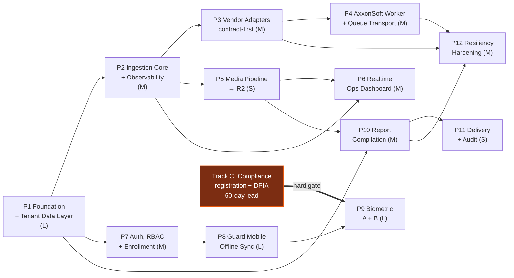

# Phased Build Plan — DeepSight

**Companion to:** `01-ARCHITECTURE.md`, `02-REPOSITORY-STRUCTURE.md` · **Status:** Draft for review

Every acceptance criterion below is a **runnable command with an observable pass/fail outcome**. None
is "it works."

---

## Dependency graph

**Track C starts on day 1 of Phase 1, in parallel.** It is not an engineering phase and consumes no
engineering capacity beyond supporting counsel, but it carries a **verified ≥60-day statutory lead
time** (`01-ARCHITECTURE.md` §10.1) and it hard-gates Phase 9. Starting it when Phase 9 starts stalls
Phase 9 for two months. This is the single highest-leverage scheduling decision in the plan.

**Two decisions are needed before Phase 1 begins:** **D6** (tenancy depth — see
`01-ARCHITECTURE.md` §1) and **Open Item 0** (repository placement). D6 in particular determines
Phase 1's schema and every acceptance test below; it is cheap to change now and expensive after
Phase 1 ships.

---

## Phase 1 — Foundation & Tenant-Isolated Data Layer

**Scope: L** · **Depends on:** nothing · **Gated on:** D6 confirmation, Open Item 0

One sentence: stand up the monorepo, the strict toolchain, and the complete PostgreSQL schema with
two-level tenant isolation proven by test.

### Built

1. pnpm workspace, `tsconfig.base.json` with all three mandated flags, ESLint/Prettier shared config
   including the `Promise.all` ban and both migration-lint rules, `check:boundaries`, CI pipeline.
2. `@deepsight/contracts` — every refined type and zod schema from `01-ARCHITECTURE.md` §6.
3. `@deepsight/config-env` — zod env validation, fail-hard at boot.
4. `@deepsight/observability` — pino JSON logger, `AsyncLocalStorage` correlation context.
5. `@deepsight/db`:
   - node-pg-migrate migrations (**up + down**) for `organizations` plus all 13 core tables and
     `alarm_closures`
   - three roles: `deepsight_owner`, `deepsight_app`, `deepsight_readonly`; GRANTs
   - `ENABLE` + **`FORCE` ROW LEVEL SECURITY**, with `USING` + `WITH CHECK` **`AS RESTRICTIVE`**
     policies on every tenant-scoped table
   - all indexes from `01-ARCHITECTURE.md` §11.2, including the partial open-alarms index
   - `withOrg()` / `withOrgClient()` / `withGlobalConfig()`; raw pool unexported
   - deterministic seeds: **2 organizations × 2 clients each**, 3 sites, 4 guards, 2 alarm sources,
     mapping rows
6. `@deepsight/test-support` — Testcontainers harness + cross-tenant assertion helpers.

### Acceptance criteria

`pnpm -r typecheck && pnpm -r lint && pnpm -r test:integration` passes in CI, including these tests —
each of which fails loudly if the corresponding control is absent:

| # | Test | Asserts |
|---|---|---|
| A1 | As `deepsight_app` under `withOrg(orgA)`, `SELECT * FROM alarm_events` returns only org A's seeded rows; count matches the seed exactly | Basic RLS read isolation |
| A2 | Under `withOrg(orgA)`, `INSERT` with `org_id` = orgB **raises** `new row violates row-level security policy` | `WITH CHECK` present — read-only isolation is not enough |
| A3 | As `deepsight_app` with **no GUC set**, every tenant table returns **0 rows** | Fails closed; a missing GUC never means "all tenants" |
| A4 | As `deepsight_owner` (the table owner) with GUC = orgA, `SELECT` returns only org A's rows | **`FORCE ROW LEVEL SECURITY` is actually applied.** This test fails if `FORCE` was omitted — the single most commonly missed RLS step |
| A5 | 100 interleaved calls alternating orgA/orgB across a pool of 5 connections: zero cross-org rows, and `current_setting('app.current_org_id', true)` is NULL on a freshly checked-out connection | The GUC is transaction-local and does not leak to the next borrower of a pooled connection (`01-ARCHITECTURE.md` §7.2) |
| A6 | `withOrgClient(orgA, clientA1)` returns zero rows belonging to clientA2, while `withOrg(orgA)` returns both clients' rows | The narrowing policy is **`AS RESTRICTIVE`**. If policies were left permissive, PostgreSQL `OR`-combines them and narrowing is silently defeated — over-exposure with no error |
| A7 | Same alarm event inserted twice → 1 row; the second insert reports 0 rows affected | `(vendor, vendor_event_id)` dedupe works and is detectable by the caller |
| A8 | `pnpm run migrate:down:up` — all migrations down, then up, then schema matches a committed snapshot | Every `down()` genuinely reverses |
| A9 | Two active enrollments for one guard → unique violation; revoking the first, then inserting → succeeds | Partial unique index `(guard_id) WHERE revoked_at IS NULL` enforces single-active-enrollment at DB level |
| A10 | Erase embedding (`embedding_vector = NULL`) → all of that guard's attendance and patrol rows still present and unchanged | Right-to-erasure is independent of the permanent audit trail (§11.4) |
| A11 | Service boots with a required env var missing → non-zero exit, error naming the variable; never a silent default | Fail-hard env contract |
| A12 | Three fixtures each fail CI: one containing `Promise.all`; one adding a `bytea` column outside the allowlist; one adding a tenant table without `org_id` + RLS + `FORCE RLS` | The enforcement rules are live, not aspirational |

A4, A5 and A6 are the tests worth reviewing most carefully — they catch the three RLS mistakes that
otherwise reach production looking exactly like working code.

### Not in Phase 1
No vendor calls, no HTTP surface, no realtime, no mobile. Pure foundation.

---

## Phase 2 — Ingestion Core & Observability Spine

**Scope: M** · **Depends on:** Phase 1

Normalize, dedupe, persist and fan out alarm events through a vendor-agnostic pipeline, with
correlation IDs threaded end to end.

### Built
- `apps/integration-engine` skeleton: env parse → bind `::` → listen; `/health`.
- Pipeline: validate → normalize → dedupe → fan out, gated on actual insertion.
- `dispatcher.ts` — exhaustive `switch` on `adapter.mode` with a `never` guard.
- `mapping-cache.ts` — `alarm_event_type_mappings` loaded at boot; `POST /admin/mappings/reload`.
- Unmapped `vendor_code` → `'unknown'` + alert carrying the retained `vendor_event_code`.
- `@deepsight/queue` with `SignedJobEnvelope` sign/verify inside the factory.
- Correlation IDs via `AsyncLocalStorage`; every log line carries
  `{ service, correlationId, orgId?, clientId?, siteId?, vendor? }`.
- Ingestion metrics: success/failure per vendor.
- Fake adapters in `test-support` for all three ingestion modes.

### Acceptance criteria
1. Feeding 1,000 fake events (200 exact duplicates) through the pipeline yields **800 rows** and a
   duplicate-suppressed metric of exactly 200.
2. Fan-out fires exactly **800** times, not 1,000 — proving fan-out is gated on insertion, not receipt.
3. An event with an unmapped `vendor_code` persists as `event_type = 'unknown'`, retains the original
   code in `vendor_event_code`, and raises exactly one alert naming that code.
4. `POST /admin/mappings/reload` after inserting a new mapping row changes normalization of the next
   event **with no process restart** (asserted by unchanged PID).
5. Adding a fourth `IngestionMode` to the union **fails `pnpm -r typecheck`** until the dispatcher
   handles it (asserted via a type-level test).
6. A job with a tampered `SignedJobEnvelope.sig` is rejected before its handler runs.
7. One request's correlation ID appears in every log line from HTTP entry through persistence through
   fan-out (asserted by parsing captured JSON logs).

---

## Phase 3 — Vendor Adapter Layer (contract-first)

**Scope: M** · **Depends on:** Phase 2 · **Constrained by:** Open Items 1–3

All three adapters as typed classes implementing the real interfaces, with unverified operations
throwing `UNVERIFIED_VENDOR_CONTRACT`.

### Built
- `guardtek/` (`mode: 'poll'`), `dahua/` (`mode: 'webhook'`), `axxon/` (`mode: 'stream'`).
- `registry.ts`; `VENDOR_TODO.md` enumerating every unresolved item per vendor.
- `@deepsight/resilience` — `createVendorPolicy()` with the **corrected** Cockatiel API (D1), breaker
  state exported per vendor.
- Dahua webhook route mounted with `express.raw()`; `verifySignature` runs pre-parse.
- Poll cursor persisted to `alarm_sources.poll_cursor`.
- Attendance ingestion via `AttendanceSource` for GuardTek.

### Acceptance criteria
1. Every adapter satisfies its interface under `pnpm -r typecheck`; **zero `any`** in the package
   (asserted by lint, with no disable comments present).
2. Calling an unverified method throws an error matching `/^UNVERIFIED_VENDOR_CONTRACT: /` with a
   message naming what needs confirming — asserted per method, so no method can be silently empty.
3. Against a local fake SOAP/HTTP server: 5 consecutive failures open the breaker; the breaker gauge
   reads `open`; a 6th call fails fast **without** a network attempt (asserted by request count on the
   fake).
4. Retry timings across 3 attempts are **non-uniform across 20 runs** — proving jitter is active, not
   plain exponential.
5. A webhook with a valid signature is accepted; the **same body with one byte changed** is rejected
   `401`; and a valid body routed through an `express.json()`-mounted route **fails the test** — the
   regression test for the D4 raw-body mistake.
6. A poll interrupted mid-stream by `AbortSignal` persists its cursor; the next poll resumes from it
   with no duplicate rows and no skipped events.

---

## Phase 4 — AxxonSoft Worker Service & Queue Transport

**Scope: M** · **Depends on:** Phase 2, Phase 3

The isolated Railway stream worker, publishing to the engine over BullMQ only.

### Built
- `apps/axxon-worker`: `/health` only, no DB credentials in its environment.
- Reconnect with exponential backoff + decorrelated jitter **from the first failure**.
- Signed job publication to `alarm.ingest`; reconnect-count metric.
- Graceful `SIGTERM`: stop accepting, drain in-flight, `stop()`.

### Acceptance criteria
1. Killing the fake Axxon endpoint and restoring it after 45 s: the worker reconnects, reconnect count
   increments, and **no events are lost** across the outage window.
2. Reconnect intervals over 10 induced failures are non-uniform, with the **first** retry already
   jittered.
3. The worker's environment contains no `DATABASE_URL` (asserted by its zod env schema rejecting one)
   and it holds zero DB connections under load.
4. 10,000 events published and consumed: engine row count exactly 10,000; queue drains to depth 0.
5. `SIGTERM` mid-stream: in-flight events are published before exit, exit code 0, no partial job.
6. `onAlarm()`'s unsubscribe is called on every reconnect — listener count stays at 1 across 50
   reconnects (the leak `01-ARCHITECTURE.md` §6.3 exists to prevent).

---

## Phase 5 — Media Pipeline → R2

**Scope: S** · **Depends on:** Phase 2 · **Constrained by:** Open Item 10

Persist expiring vendor media to R2 before the URLs die.

### Built
- `@deepsight/storage-r2`; BullMQ `media.fetch` worker; streaming multipart upload.
- `incident_media` rows storing `r2_object_key` — never bytes.
- Priority ordering by `MediaRef.expires_at` when the vendor provides one.
- Signed-URL issuance for dashboard access.

### Acceptance criteria
1. A fake vendor URL expiring in 30 s is fetched and persisted to R2 within 30 s; `incident_media`
   holds the object key and **no binary column exists on the table** (asserted against
   `information_schema`).
2. A 50 MB object uploads with process RSS growth under 20 MB — proving streaming, not buffering.
3. A vendor URL that 404s marks the media row `failed` with structured error detail and **does not**
   fail the parent alarm event's ingestion.
4. Signed URLs expire; an expired URL returns 403 from R2.
5. Given 3 media refs with different expiries, fetch order matches ascending expiry.

---

## Phase 6 — Realtime Ops Dashboard

**Scope: M** · **Depends on:** Phase 2 (Phase 5 for media thumbnails)

Supervisor live view over Socket.io.

### Built
- Socket.io + Redis adapter on the engine; one room per `org:{id}`, authorized on connect.
- Dashboard: live alarm feed, patrol completion per site, attendance with face-match scores,
  per-vendor breaker state, Axxon reconnect status, report queue, per-guard enrollment status.

### Acceptance criteria
1. Two browser clients in different organizations: an event for org A reaches A's socket and **never**
   appears on B's (asserted at the socket level, not visually).
2. p95 ingestion→dashboard latency < 2 s over 100 events.
3. Killing one of two engine instances: connected clients reconnect and resume receiving within 10 s
   (Redis adapter fan-out works).
4. Tripping a vendor breaker changes that vendor's dashboard indicator within 5 s.
5. A socket whose session has been revoked is disconnected on its next heartbeat.

---

## Phase 7 — Auth, RBAC & Device Enrollment Provisioning

**Scope: M** · **Depends on:** Phase 1 · **Constrained by:** Open Item 9 (DNS)

Both auth surfaces plus supervisor-initiated device provisioning.

### Built
- Dashboard: Argon2id login, Redis server-side sessions, RBAC (`admin`/`supervisor`/`report_viewer`).
- Guard: 15-min access JWT + device-bound rotating refresh token with reuse detection.
- Enrollment tokens: **server-generated, single-use, time-limited** — never hardcoded.
- Service-to-service JWT with `kid` dual-secret rotation.

### Acceptance criteria
1. An enrollment token is single-use: a second redemption returns `410 Gone`. It expires (default
   15 min): expired redemption returns `410`. **No token value appears anywhere in the source tree**
   (asserted by a repo-wide scan in CI).
2. Setting `revoked_at` on an enrollment causes the **next refresh** to fail `401` and invalidates the
   token family.
3. Replaying an already-consumed refresh token invalidates the whole family and forces
   re-provisioning.
4. A `report_viewer` session receives `403` on every enrollment and revocation endpoint (asserted per
   route, table-driven, so a new route cannot be added unguarded).
5. Dashboard logout invalidates the session **server-side**: the same cookie returns `401` immediately
   after.
6. A `supervisor` in org A receives `403`/404 on every org B resource, **and** the underlying query
   returns zero rows even if the route check is bypassed — RBAC and RLS are independently sufficient.
7. A service JWT signed with `SVC_SECRET_PREVIOUS` verifies during the rotation window; one signed
   with an unknown `kid`, or with `exp` in the past, is rejected.

---

## Phase 8 — Guard Mobile: Offline Event Log & Sync

**Scope: L** · **Depends on:** Phase 7 · **Constrained by:** Open Items 4, 12

Offline-first Android app with an immutable local event log. **No biometrics yet** — that is Phase 9.

### Built
- WatermelonDB schema + migrations; all events immutable with device-minted `client_event_id`.
- `pullChanges`/`pushChanges` against the engine's sync endpoint; background sync task.
- Sign-in/out, NFC + QR patrol scan, alarm acknowledgement with notes (closure as an event).
- GPS geofence check at sign-in: outside radius → **store with flag**, never silently drop.
- Keystore-backed refresh token; sync-queue-depth metric.

### Acceptance criteria
1. Airplane mode for a full simulated 12-hour shift: sign-in, 20 patrol scans and 3 alarm closures all
   persist locally and the UI reflects them **with zero network**. On reconnect, all 24 events land
   server-side exactly once.
2. Sync interrupted mid-push and retried: server row count unchanged — `(device_id, client_event_id)`
   idempotency holds.
3. Two devices reporting overlapping sign-ins for one guard: **both events persist** (append-only);
   neither overwrites the other; the conflict is surfaced to supervisors.
4. Sign-in 500 m outside a 100 m site radius: the event persists with `geofence_violation = true` and
   the recorded distance, and appears flagged on the dashboard.
5. An access token expired mid-shift does **not** block any local write (the §9.1 offline
   interaction); sync succeeds after refresh on reconnect.
6. A revoked enrollment blocks the next sign-in **after** the next successful sync; events recorded
   offline after `revoked_at` are accepted but flagged for supervisor review, not dropped.
7. A WatermelonDB schema migration on a device holding 500 unsynced events loses none of them.

---

## Phase 9 — Biometric Verification (Components A + B)

**Scope: L** · **Depends on:** Phase 8 · **HARD-GATED on Track C** · **Open Items 5, 6, 6b, 11**

> **This phase must not start** until registration and the DPIA are confirmed complete by counsel in
> the applicable jurisdiction, **or** the client defers them **in writing** with accepted risk
> documented. `01-ARCHITECTURE.md` §10.1 establishes a verified ≥60-day statutory lead time.

### Built
- Component A: platform `BiometricPrompt` liveness gate, PIN fallback, flagged.
- Component B: 1:1 face match behind the `FaceMatcher` interface, SDK per Open Item 5.
- Enrollment: on-device embedding → TLS → `guard_enrollments`; token invalidated on success.
- Per-event artifact: `{ score, threshold, sdk, sdk_version, decision }` — **never an image**.
- Configurable per-client threshold with an audit trail of changes.
- Right-to-erasure endpoint nulling `embedding_vector` and writing an erasure audit record.

### Acceptance criteria
1. Full enrollment against the selected SDK: `guard_enrollments` holds a non-null embedding, and a
   filesystem + network capture proves **no face image** was written to disk server-side or
   transmitted (asserted by inspecting captured request bodies).
2. Component A pass + Component B fail → sign-in **rejected**, event recorded with the failing score
   and a distinct reason code separate from an A failure. The two components' failures are never
   collapsed into one code.
3. Component A fail → PIN fallback path, event flagged, and Component B **still required**.
4. A below-threshold match is rejected; a supervisor override succeeds and is recorded with the
   overriding user's ID.
5. Erasure: embedding NULL, erasure audit row written, and **every** historical attendance, patrol and
   closure record for that guard still present and byte-identical (re-asserts A10 against real data).
6. No `bytea`/`blob` column exists on any table other than `guard_enrollments.embedding_vector`
   (asserted against `information_schema`) — D5's boundary holds after the phase most likely to breach
   it.
7. Repo-wide scan: no raw biometric image is persisted at any layer.

---

## Phase 10 — Report Compilation Engine

**Scope: M** · **Depends on:** Phase 1, Phase 5

Scheduled per-client aggregation → HTML/CSS → PDF via a pooled Chromium → R2.

### Built
- `apps/report-worker`: bounded Playwright pool, `newContext()` per render, recycle after N=50 and on
  an RSS ceiling.
- Aggregation with **`Promise.allSettled`** per source → `complete | partial | stale_data`.
- HTML/CSS template; PDF archived to R2.
- `report_runs` written on **every** outcome with structured error detail.

### Acceptance criteria
1. 20 concurrent report jobs complete with **at most N+1 browser processes ever spawned** (asserted by
   process sampling) — proving pooling, not per-report launch.
2. With one vendor source failing, client A's report is marked `partial` with error detail **and
   clients B and C still produce `complete` reports in the same run** — partial failure isolated.
3. A render that throws still writes a `report_runs` row with `status = 'failed'` and the error; no
   silent disappearance.
4. 200 sequential renders with the pool's RSS returning to within 15% of baseline after recycling — no
   unbounded creep.
5. Report PDF byte-identical across two runs over identical frozen data (deterministic rendering).
6. Per-client report queries run under `withOrgClient()`: a report for org A / client A1 contains
   **zero** rows belonging to client A2 or to org B (asserted by seeding a distinguishable marker into
   each).

---

## Phase 11 — Delivery Layer & Audit

**Scope: S** · **Depends on:** Phase 10 · **Constrained by:** Open Item 13

### Built
- Transactional email send of the archived PDF; `report_delivery_log` per **attempt**.
- Bounce/failure handling; retry with backoff; `r2_archive_key` on each log row.

### Acceptance criteria
1. Successful compile + **failed** delivery: `report_runs.status = 'complete'` **and**
   `report_delivery_log.delivery_status = 'failed'` — the failed delivery does not obscure the
   successful compilation (the separation the brief requires).
2. Three recipients where one bounces: two `sent` rows, one `bounced` row, all three carrying the same
   `report_run_id` and `r2_archive_key`.
3. Delivery retried after a transient failure writes a **second** log row; the first is retained —
   attempt history is append-only.
4. The correlation ID from ingestion is present on the delivery log row, closing the
   ingestion → delivery trace the brief requires.

---

## Phase 12 — Resiliency Hardening, Metrics & Alerting

**Scope: M** · **Depends on:** Phase 3, Phase 4, Phase 10

### Built
- Full metric set: per-vendor ingestion rate, breaker state, Axxon reconnect count, mobile sync queue
  depth, report duration/outcome, delivery success rate.
- **Breaker-open-beyond-60 s alert** as a periodic sweep over the exported gauge, not a `setTimeout`.
- Railway log drain export; dead-letter queue + `ingestion_failures` review surface.
- Load test and documented capacity limits.

### Acceptance criteria
1. Holding a vendor breaker open for 70 s fires exactly **one** alert (not a log line, and not a
   storm); recovery fires a resolution.
2. Restarting the engine while a breaker is open still produces the alert — proving the sweep is not
   in-process timer state lost on redeploy.
3. Every metric in the brief's §3 list is present and non-zero under a synthetic load run
   (table-driven assertion over metric names, so a missing metric fails rather than being noticed
   months later).
4. A poison-pill event lands in the DLQ, appears on the review surface, and does **not** stall the
   queue.
5. Load test: sustained 50 events/sec for 10 minutes with zero row loss and p95 ingest→dashboard under
   2 s; documented breaking point.

---

## Track C — Compliance (parallel, non-engineering, starts with Phase 1)

Shaped by D6: under multi-operator SaaS, each operator is a **controller** and DeepSight is a
**processor**, so DeepSight registers in its own right and every operator onboarding carries a
compliance prerequisite.

| Step | Output | Lead time |
|---|---|---|
| C0 | Confirm applicable jurisdiction(s) for DeepSight and its operators (Open Item 6b) | Days |
| C1 | Counsel confirms registration status/obligation — for DeepSight as processor and each operator as controller | Client-dependent |
| C2 | DPIA drafted (this platform is high-risk on two independent grounds: large-scale sensitive-data processing **and** systematic monitoring) | 2–4 weeks |
| C3 | DPIA filed with the supervisory authority | **≥60 days before processing begins** |
| C4 | Data Processing Agreement template for operator onboarding | 1–2 weeks, parallel to C2 |
| C5 | Written sign-off, **or** written deferral with documented accepted risk | Gate for Phase 9 |

**Acceptance criterion:** a signed document in the project record either clearing biometric processing
or explicitly deferring it with accepted risk. Phase 9 does not start without it.

---

## Scope summary

| Phase | Scope | Blocked by an open item today? |
|---|---|---|
| P1 Foundation & Data Layer | L | **D6 + Open Item 0** |
| P2 Ingestion Core | M | No |
| P3 Vendor Adapters | M | Bodies only (Items 1–3); structure unblocked |
| P4 AxxonSoft Worker | M | Body only (Item 3) |
| P5 Media Pipeline | S | Item 10 (R2 provisioning) |
| P6 Ops Dashboard | M | No |
| P7 Auth & Enrollment | M | Item 9 (DNS) affects cookie policy only |
| P8 Guard Mobile | L | Items 4, 12 |
| P9 Biometric | L | **Hard-gated: Items 5, 6, 6b, 11 + Track C** |
| P10 Report Engine | M | No |
| P11 Delivery | S | Item 13 |
| P12 Hardening | M | No (Item 8 resolved for MVP) |

**Critical path:** P1 → P7 → P8 → P9, with P9 gated on Track C. The entire ingestion side (P2–P6,
P10–P12) proceeds in parallel with the mobile track — which is why Phase 1's foundation work is worth
doing thoroughly rather than quickly: every other phase builds directly on its tenancy guarantees.
